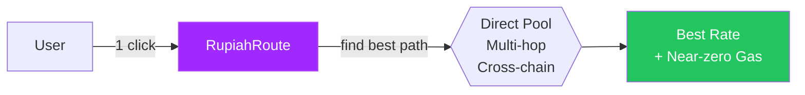
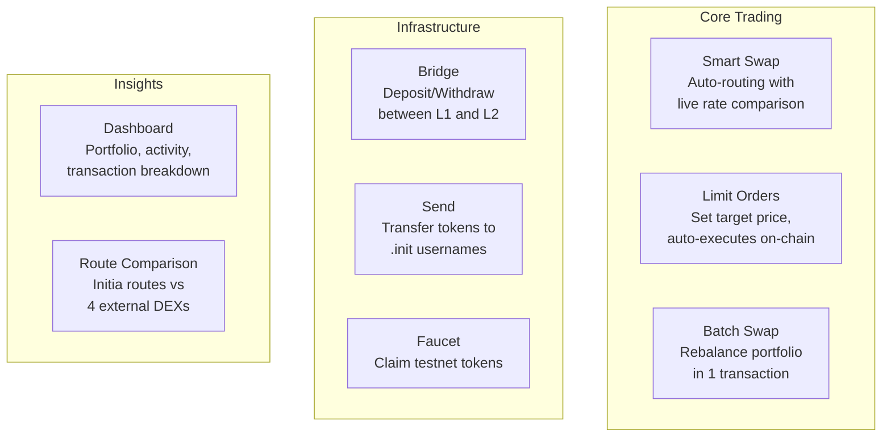
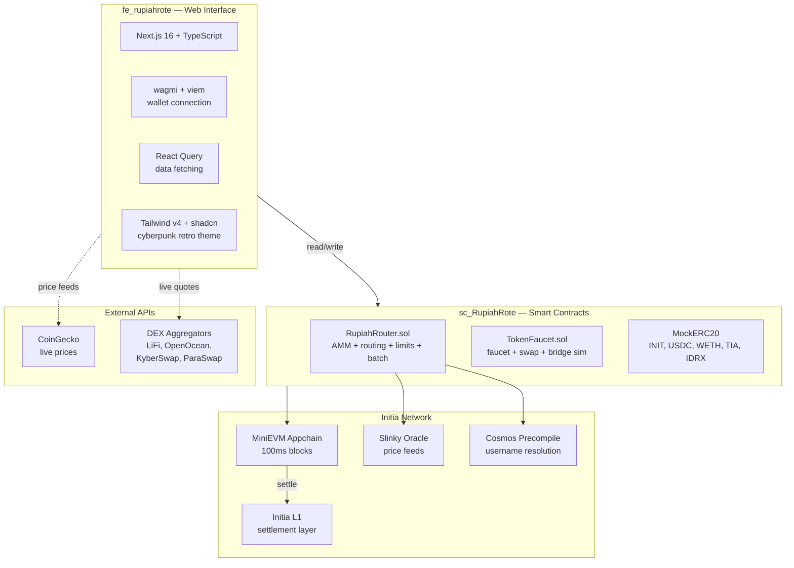
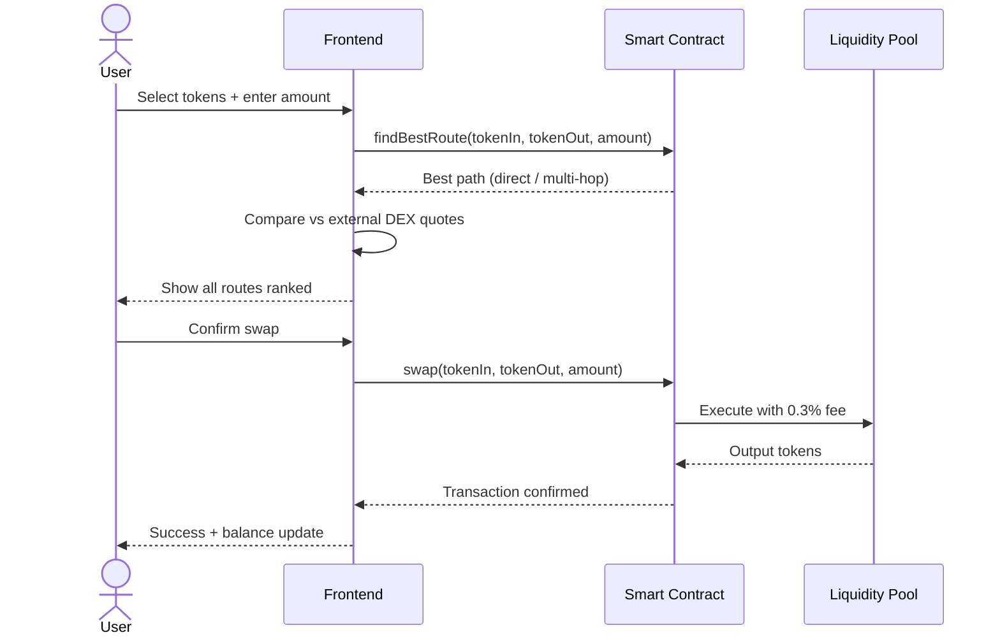

# RupiahRoute

**Smart DeFi Router on Initia**

One interface, one click. Input token A, output token B — the engine finds the best route, cheapest gas, and executes everything on an Initia EVM appchain with near-zero fees.



## What is RupiahRoute?

RupiahRoute is a **smart routing engine** running as its own Initia EVM appchain (L2). It automatically finds the optimal swap path — direct, multi-hop, or cross-chain — so users never have to think about which DEX, which pool, or which bridge to use.

Think of it as **Google Maps for DeFi**: enter your starting token and destination token, and the router handles the rest.

## Why Initia?

| Feature | Benefit |
|---------|---------|
| **L2 Appchain** | 100ms blocks, near-zero gas fees |
| **Interwoven Bridge** | Seamless L1-L2 token transfers |
| **Cosmos Precompiles** | On-chain username resolution (.init), oracle price feeds |
| **MiniEVM** | Full EVM compatibility with Cosmos interoperability |

## Features



| Feature | Description |
|---------|-------------|
| **Smart Swap** | Compares direct pool, multi-hop, and cross-chain routes. Live comparison against 4 external DEX aggregators (LiFi, OpenOcean, KyberSwap, ParaSwap). |
| **Limit Orders** | Set a target price with expiry. Order auto-executes when price is reached. Fully on-chain with keeper pattern. |
| **Batch Swap** | Allocate percentages to multiple target tokens. One transaction, atomic execution. |
| **Bridge** | Move tokens between Initia L1 and the RupiahRoute appchain via Interwoven Bridge. |
| **Send to Username** | Send tokens using .init usernames instead of hex addresses. Resolved on-chain via Cosmos precompile. |
| **Dashboard** | Live portfolio balances, transaction history with per-type details, activity breakdown. |
| **Faucet** | Testnet token claims with live balance tracking and animated feedback. |

## Architecture



## Project Structure

```
initia/
├── fe_rupiahrote/          # Frontend — Next.js web app
│   ├── app/                # Pages (swap, limit, batch, bridge, send, faucet, dashboard)
│   ├── components/         # 25+ React components
│   ├── lib/                # Business logic, contracts, i18n
│   └── README.md           # Frontend documentation
│
├── sc_RupiahRote/          # Smart Contracts — Foundry/Solidity
│   ├── src/                # RupiahRouter, TokenFaucet, interfaces, mocks
│   ├── script/             # Deployment scripts
│   ├── test/               # Test suite
│   └── README.md           # Contract documentation
│
└── README.md               # This file
```

| Folder | What | README |
|--------|------|--------|
| [`fe_rupiahrote/`](./fe_rupiahrote/) | Next.js frontend with wallet integration, route comparison, i18n | [Frontend README](./fe_rupiahrote/README.md) |
| [`sc_RupiahRote/`](./sc_RupiahRote/) | Solidity contracts — AMM, router, limit orders, faucet | [Contract README](./sc_RupiahRote/README.md) |

## Quick Start

### 1. Start Initia Local Node

```bash
# Start Initia MiniEVM rollup
weave start
```

### 2. Deploy Smart Contracts

```bash
cd sc_RupiahRote

# Deploy router
forge script script/RupiahRouter.s.sol \
  --rpc-url http://localhost:8545 --private-key $DEPLOYER_KEY \
  --broadcast --legacy

# Deploy faucet
forge script script/TokenFaucet.s.sol \
  --rpc-url http://localhost:8545 --private-key $DEPLOYER_KEY \
  --broadcast --legacy

# Setup pools + seed liquidity
forge script script/SetupPools.s.sol \
  --rpc-url http://localhost:8545 \
  --broadcast --legacy
```

### 3. Start Frontend

```bash
cd fe_rupiahrote

# Configure .env.local with deployed addresses
cp .env.example .env.local

npm install
npm run dev
# Open http://localhost:3000
```

## Supported Tokens

| Token | Type | Description |
|-------|------|-------------|
| INIT | Native | Initia network token |
| USDC | Stablecoin | USD-pegged stablecoin |
| WETH | Wrapped | Wrapped Ether |
| TIA | Cross-chain | Celestia token |
| IDRX | Stablecoin | Indonesian Rupiah stablecoin |
| GAS | Native | Appchain gas token |

## How It Works



## Languages

The interface supports three languages, switchable via dropdown in the header:

- **English** (default)
- **Indonesian** (Bahasa Indonesia)
- **Chinese Simplified** (simplified Chinese with English DeFi terms preserved)

## License

MIT
