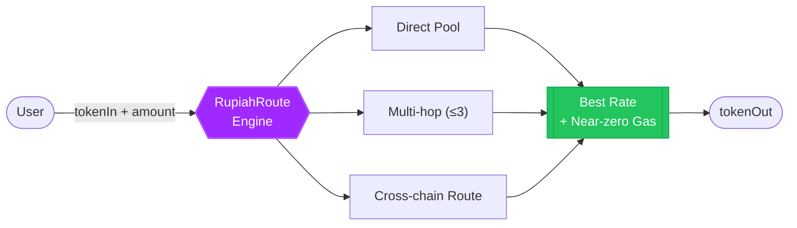
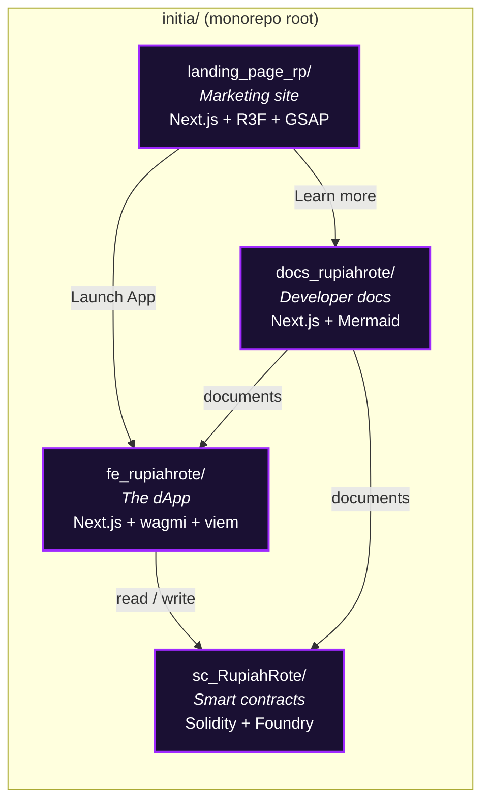
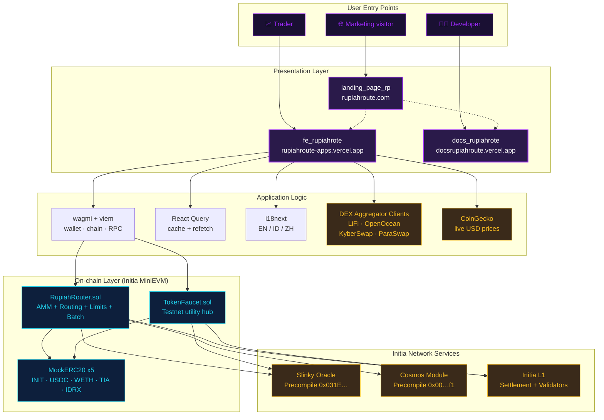
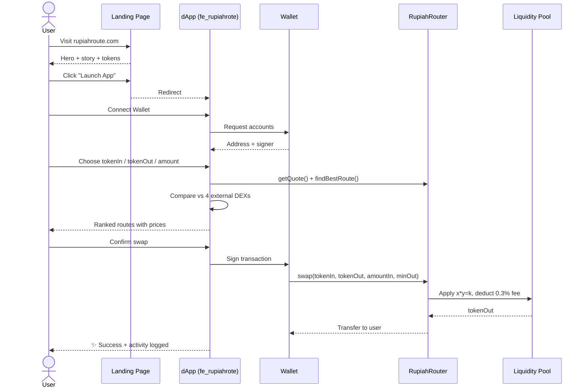
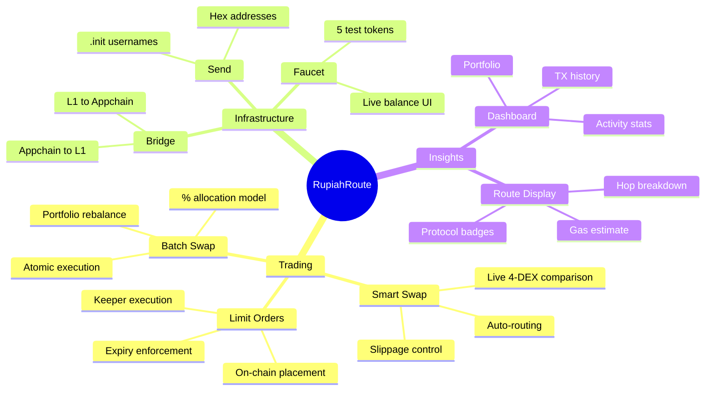
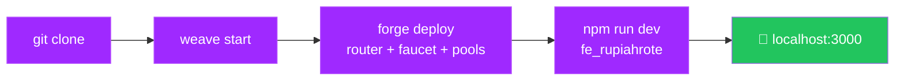
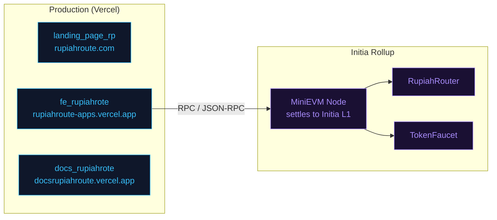

<div align="center">

# RupiahRoute

**The Smart DeFi Router on Initia — One Click. Best Route. Zero Hassle.**

A unified on-chain routing engine that discovers the optimal path for any swap —
direct pool, multi-hop, or cross-chain — and executes it on an Initia EVM
appchain with 100&nbsp;ms blocks and near-zero gas.

[Launch App](https://rupiahroute-apps.vercel.app/) &nbsp;•&nbsp;
[Documentation](https://docsrupiahroute.vercel.app/) &nbsp;•&nbsp;
[Landing Page](./landing_page_rp/)

</div>

---

## Table of Contents

1. [Overview](#overview)
2. [Why Initia?](#why-initia)
3. [Monorepo Layout](#monorepo-layout)
4. [System Architecture](#system-architecture)
5. [User Journey](#user-journey)
6. [Feature Matrix](#feature-matrix)
7. [Supported Tokens](#supported-tokens)
8. [Quick Start](#quick-start)
9. [Deployment Topology](#deployment-topology)
10. [Internationalization](#internationalization)
11. [License](#license)

---

## Overview

RupiahRoute solves one of the oldest pains in DeFi: **choosing the right venue**.
Instead of forcing users to compare DEXs, aggregate quotes, and manage slippage,
RupiahRoute abstracts the entire routing layer behind a single clean interface.

Think of it as **Google Maps for DeFi** — pick a start token, pick an end token,
and the router finds the fastest, cheapest path automatically.



---

## Why Initia?

RupiahRoute is not a generic L1 dApp — it is deployed as its own **MiniEVM
appchain** (an Initia Rollup) for maximum throughput, deterministic settlement
on Initia L1, and seamless Cosmos interoperability.

| Layer | Capability | What it Unlocks |
|------|------------|-----------------|
| **MiniEVM Appchain** | 100 ms blocks, EVM-equivalent | Uniswap-class UX with no MEV tax |
| **Interwoven Bridge** | Native L1 ↔ L2 messaging | 1-click deposits / withdrawals |
| **Cosmos Precompiles** | `0x00…f1` address module | Resolve `.init` usernames on-chain |
| **Slinky Oracle** | `0x031E…b72F` price feeds | Trustless USD pricing for limit orders |
| **Shared Security** | Settles to Initia L1 | Inherits L1 finality + validator set |

---

## Monorepo Layout

The project is split into **four independent but cohesive packages** plus a
root workspace.



| Package | Purpose | Stack | README |
|---------|---------|-------|--------|
| [`landing_page_rp/`](./landing_page_rp/) | Public marketing site, animated 3D hero, launch CTA | Next.js 16 · Three.js · GSAP · Framer Motion | [↗](./landing_page_rp/README.md) |
| [`fe_rupiahrote/`](./fe_rupiahrote/) | The production dApp — swap, limit, batch, bridge, send, faucet, dashboard | Next.js 16 · wagmi · viem · Tailwind v4 | [↗](./fe_rupiahrote/README.md) |
| [`docs_rupiahrote/`](./docs_rupiahrote/) | Developer documentation with Mermaid diagrams and code samples | Next.js 16 · Mermaid · Prism | [↗](./docs_rupiahrote/README.md) |
| [`sc_RupiahRote/`](./sc_RupiahRote/) | On-chain contracts — AMM, router, limit orders, faucet | Solidity 0.8.24 · Foundry | [↗](./sc_RupiahRote/README.md) |

---

## System Architecture



---

## User Journey



---

## Feature Matrix



| Feature | Surface | Backed By |
|---------|---------|-----------|
| **Smart Swap** | `/` | `RupiahRouter.findBestRoute` + `executeRoute` |
| **Limit Orders** | `/limit` | `RupiahRouter.placeLimitOrder` (oracle-priced) |
| **Batch Swap** | `/batch` | `RupiahRouter.batchSwap` (atomic multi-leg) |
| **Bridge** | `/bridge` | Interwoven Bridge + `TokenFaucet` simulation |
| **Send to Username** | `/send` | Cosmos precompile `0x00…f1` |
| **Dashboard** | `/dashboard` | On-chain reads + localStorage activity log |
| **Faucet** | `/faucet` | `TokenFaucet.claimToken` |

---

## Supported Tokens

| Symbol | Type | Decimals | Notes |
|--------|------|----------|-------|
| **INIT** | Native | 18 | Initia network token |
| **USDC** | Stablecoin | 6 | USD-pegged |
| **WETH** | Wrapped | 18 | Wrapped Ether |
| **TIA** | Cross-chain | 6 | Celestia token |
| **IDRX** | Stablecoin | 2 | Indonesian Rupiah stablecoin |
| **GAS** | Native | 18 | Appchain gas token |

---

## Quick Start

> **Prerequisites:** Node.js ≥ 20, pnpm/npm, Foundry (`forge`, `anvil`), and the
> [Initia Weave](https://docs.initia.xyz/) CLI for the local rollup.

### 1. Clone & install

```bash
git clone <repo-url> initia
cd initia
```

### 2. Boot the local Initia MiniEVM rollup

```bash
weave start
```

> The rollup exposes RPC at `http://localhost:8545`.

### 3. Deploy the smart contracts

```bash
cd sc_RupiahRote

forge script script/RupiahRouter.s.sol  --rpc-url http://localhost:8545 --private-key $DEPLOYER_KEY --broadcast --legacy
forge script script/TokenFaucet.s.sol   --rpc-url http://localhost:8545 --private-key $DEPLOYER_KEY --broadcast --legacy
forge script script/SetupPools.s.sol    --rpc-url http://localhost:8545 --broadcast --legacy
```

### 4. Run the dApp

```bash
cd ../fe_rupiahrote
cp .env.example .env.local   # fill in deployed addresses
npm install
npm run dev                  # → http://localhost:3000
```

### 5. (Optional) Run the landing page & docs

```bash
cd ../landing_page_rp && npm install && npm run dev    # → :3000
cd ../docs_rupiahrote && npm install && npm run dev    # → :3000
```



---

## Deployment Topology



---

## Internationalization

The dApp UI ships with three languages out of the box:

| Code | Language | Notes |
|------|----------|-------|
| `en` | English | Default |
| `id` | Bahasa Indonesia | Full translation |
| `zh` | 中文 (Simplified) | CJK font stack, DeFi terms kept in English |

Translation files live in [`fe_rupiahrote/lib/i18n/`](./fe_rupiahrote/lib/i18n/).

---

## License

MIT © RupiahRoute contributors.
