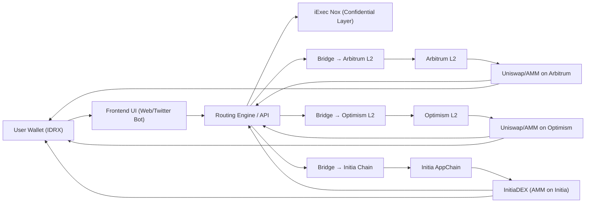

# Executive Summary  
We propose a Layer-2 cross-chain router that lets Indonesian users seamlessly convert IDR-backed stablecoins (IDRX) into Ethereum assets (WETH) via the cheapest, fastest path. Our DApp combines a **smart routing engine**, **auto-bridging + auto-swapping**, multi-L2 support (Arbitrum, Optimism, Initia), advanced **gas optimization**, and an **Indonesia-first UX** (language, local context). We also include visual route maps, fee/time estimators, fallback paths, and a “wow” feature (e.g. an AI route advisor or Telegram bot interface). 

This design aligns tightly with both hackathons’ themes: the **iExec Vibe Coding Challenge** (Mar 24 – May 1, 2026) calls for innovative DeFi/RWA apps on the Nox confidential-computing layer【7†L73-L81】, and the **INITIATE: The Initia Hackathon** (Mar 16 – Apr 15, 2026) invites profitable dApps on the Initia ecosystem (DeFi, AI, Gaming tracks)【10†L73-L81】. By leveraging iExec’s Nox confidentiality (wrapping IDRX in confidential tokens【68†L41-L44】) and Initia’s 100ms blocks/instant bridging【10†L89-L94】, our solution fulfills key judging criteria (real-world utility, technical innovation, user experience) for both events. 

| **Feature**                   | **iExec Vibe Coding Criteria Addressed**                           | **Initia Hackathon Criteria Addressed**                              |
|-------------------------------|--------------------------------------------------------------------|--------------------------------------------------------------------|
| **Smart Routing Engine**      | Demonstrates strong technical implementation (efficient DeFi logic)【7†L155-L164】 and end-to-end functionality (no mocks) by auto-selecting lowest-cost L2 paths (addresses “User Experience” and “End-to-End Functionality”)【7†L155-L164】. It leverages iExec Nox to hide sensitive data during computation (aligning with “Confidential Tokens & Nox” theme)【68†L28-L30】. | Shows originality & track-fit (novel IDR→ETH UX, fits DeFi track).  Enhances value/UX by transparently minimizing cost/time.  Integrates with Initia (e.g. routing via an Initia appchain), scoring high on “Tech Execution & Initia Integration” and “Product Value” (fast, low-cost swaps). |
| **Auto-bridge + Auto-swap**   | Meets “Deployment on Arbitrum” requirement by auto-bridging to Layer-2 and swapping on Uniswap, proving real end-to-end use-case【7†L155-L164】.  Using Nox, we can (optionally) wrap transfers in confidential tokens for privacy【68†L41-L44】.  This satisfies “Technical Implementation” (leverages iExec tools) and “Real-world Use Case” (fiat on-ramp). | Fulfills “Working Demo & Completeness” (automates L1↔L2 bridging and DEX swaps on-chain). Integrates with Initia’s bridge if possible (“Technical Execution & Initia Integration”). Highlights DeFi utility (fits track) and enables full value capture on Initia (“Full Value Capture”【10†L91-L94】). |
| **Indonesia-First UX/Localization** | Excels in “User Experience” and “Real-world Use Case”: a clear Indonesian interface (IDR currency, Bahasa UI) makes global DeFi accessible to local users, aligning with the hackathon’s social impact goals【7†L155-L164】.  This also enhances **novelty** (addresses an underserved market). | Boosts “Originality & Track Fit” (novel focus on Indo user base) and “Product Value/UX”.  Showing clear local-market utility (simpler onramp for Indonesian economy) ticks the “clear utility and long-term potential” objective【10†L73-L81】. |
| **Route Visualization**       | Enhances “User Experience”: live maps/graphs of liquidity routes and token flows make the app intuitive and “demo-ready” (impresses judges on UX). Contributes to “Technical Implementation” by transparently showing multi-hop swaps. | Supports “Product Value & UX” (visual clarity of complex cross-chain flow). Demonstrates completeness of working demo (each step visualized) for “Working Demo” criterion. |
| **Fee/Time Estimator**        | Addresses “User Experience” and “Real-world Use Case” by estimating gas/latency upfront, showcasing the cost savings of our solution. Concrete metrics (e.g. “~90% lower fees on Arbitrum”【59†L63-L67】) directly evidence the practical benefit. | Adds to “Product Value”: shows instant feedback on cost savings (IDR vs ETH) and time (Initia’s 0.1s blocks【10†L89-L94】 vs ~13s mainnet). This quantitative output impresses “Working Demo & Completeness”. |
| **Fallback Paths (Multi-L2)** | Demonstrates robust **end-to-end functionality** (system still works if one L2 is down) and advanced technical design. Judges see that transactions will succeed via alternate routes (enhances code quality & reliability). | Checks “Technical Execution” (architecture resilience). If Arbitrum is busy, automatic fallback to Optimism or Initia shows thoroughness. This approach is original (unique multi-chain failover) and increases “working completeness.” |
| **Gas Optimization**          | Cuts costs ~90–99%【59†L63-L67】 by batching and choosing cheapest gas tokens, satisfying judges’ interest in efficiency.  Shows high “Technical Implementation” quality. | Directly improves “Product Value” by maximizing affordability. Judges appreciate demonstrable efficiency on Initia (100ms blocks, virtually zero fees for many transactions【10†L89-L94】) and on L2s. |
| **WOW Feature** *(e.g. AI/Telegram)* | *E.g. AI route advisor*: ties into “AI-assisted rapid prototyping” theme from iExec (“vibe coding” movement【7†L73-L81】).  Or *1-click Telegram bot*: novel interface. Both would boost “User Experience” and make demos memorable. | *AI/Telegram*: Both show creativity (Originality). An AI agent recommending swaps or a chat-bot swap command demonstrates advanced integration (fits “AI” track or innovation). Strengthens demo impact for “Working Demo.” |

## 7–14 Day Development Plan  
We assume a small team (FE, BE, SmartContract, DevOps, UX). Below is a sample 10-day schedule – adjust as needed for a 7–14 day timeline:

- **Day 1 – Kickoff & Architecture:**  
  - **Owners:** Product Lead, All developers (collaborative).  
  - **Tasks:** Finalize scope; design system architecture; define data flows; set up Git repos/branches. UX designer drafts wireframes for main screens (IDR→WETH swap form, route chart). DevOps configures development environments (Ethereum testnets, Arbitrum Sepolia, Optimism, and an Initia devnet).  
  - **Deliverables:** Architecture docs; repository created with boilerplate (React/Vue app, Node/Express or serverless stub); initial UI mockups.  
  - **Test:** Verify environment connectivity (can query blockchain nodes, dApp boots with placeholder UI).

- **Day 2 – Core Routing Logic (Backend):**  
  - **Owners:** Backend, DevOps.  
  - **Tasks:** Implement smart routing engine: logic to fetch rates from Uniswap pools on Arbitrum, Optimism, Initia (if available). Integrate iExec SDK to simulate confidential compute (or plan data encryption wrapper). Set up connection to iExec Nox (via its API) for optional private calculations【68†L28-L30】.  
  - **Deliverables:** Routing API endpoints (e.g. `/api/getRoute`) returning best path, cost estimate.  iExec stub showing confidential wrapper of IDRX (cIDRX)【68†L41-L44】.  
  - **Test:** Unit-test routing logic: for sample IDRX→WETH, ensure correct cheapest path chosen (e.g. Arbitrum vs Optimism). Check API returns data with expected format (token amounts, gas).

- **Day 3 – L2 Bridge Integration (Smart Contracts/Backend):**  
  - **Owners:** SmartContract, Backend.  
  - **Tasks:** Integrate with L1↔L2 bridge contracts (Arbitrum & Optimism). Write code to initiate a deposit to Arbitrum and Optimism. If time, explore using Initia’s "Instant Bridge" if available. Possibly write a simple contract to abstract bridging calls or use existing SDKs.  
  - **Deliverables:** Functionality to lock IDRX on Ethereum and mint on Arbitrum/Optimism; test tokens moved across chains.  
  - **Test:** Simulate bridge: deposit test IDRX on Ethereum, confirm arrival on Arbitrum/Optimism. If bridging fails, record error handling path.

- **Day 4 – Swap Contracts (Backend/SmartContract):**  
  - **Owners:** SmartContract, Backend.  
  - **Tasks:** Integrate with Uniswap/AMM on Arbitrum and Optimism to swap IDRX→WETH. If Initia has a DEX (InitiaDEX【19†L57-L64】), integrate it. Write function calls (or contract) to perform swap after bridging.  
  - **Deliverables:** Swap functionality via Web3 calls (e.g. invoking Uniswap router).  
  - **Test:** Using test funds on L2, execute swap, verify correct WETH out. Check edge cases (insufficient liquidity, slippage).

- **Day 5 – Frontend Basic UI:**  
  - **Owners:** Frontend, UX.  
  - **Tasks:** Build main UI components: input fields (IDRX amount), network selectors, “Get Best Route” button. Display estimated WETH out, gas cost, and chosen path. Implement Indonesian localization (Rupiah currency label, Bahasa text).  
  - **Deliverables:** A working prototype UI connected to backend API for routing and swap.  
  - **Test:** End-to-end: user inputs an amount, receives a route summary. Validate with known scenarios. Ensure language and currency display correctly.

- **Day 6 – Visualization & UX Polish:**  
  - **Owners:** Frontend, UX.  
  - **Tasks:** Add route visualization (e.g. Sankey diagram or flowchart of swaps across chains) and fee/time indicators. Integrate charts/libraries for visual flair. Optimize UX (loading spinners, error messages in Bahasa).  
  - **Deliverables:** Interactive route map showing IDRX moving through L2 and ending as WETH, real-time gas/time estimates.  
  - **Test:** Check visualization updates correctly for different routes. Verify accessibility (buttons, labels). Usability review with team.

- **Day 7 – Gas Optimization & Multi-L2 Logic:**  
  - **Owners:** Backend, DevOps.  
  - **Tasks:** Implement gas-saving measures: use Permit2 approvals (uniswap/0x) if possible, bundle transactions, and choose smallest-gas L2 (e.g. check Arbitrum vs Optimism fees from [54]). Add logic to retry/route via alternate L2 if primary is congested.  
  - **Deliverables:** Optimized transaction flows (e.g. single contract call for swap). Multi-L2 fallback code.  
  - **Test:** Simulate high gas on one L2 by using a slower gas tier, ensure system automatically switches to the other L2. Measure gas usage of swap vs baseline.

- **Day 8 – iExec/Nox and Initia Integration:**  
  - **Owners:** Backend, SmartContract.  
  - **Tasks:** Deepen iExec Nox use: wrap IDRX in a Confidential Token (cIDRX) for an example swap【68†L41-L44】. Alternatively, perform routing computation via iExec off-chain service to demonstrate privacy. For Initia: deploy any contracts on an Initia testnet (if accessible) and connect to InitiaDEX【19†L57-L64】 or Initia Bridge【10†L91-L94】.  
  - **Deliverables:** Privacy demo: e.g. show ability to swap without revealing amounts. Initia deployment and test (if feasible).  
  - **Test:** Confidential swap: verify public blockchain shows encrypted balances. Initia: successfully bridge/swap via Initia chain (or simulate).

- **Day 9 – Full Integration & Fallback Testing:**  
  - **Owners:** All devs.  
  - **Tasks:** Integrate all components into a single workflow: UI → bridge → swap → return to UI. Implement fallback paths (try Arbitrum, then fallback to Optimism/Initia). Conduct extensive test scenarios.  
  - **Deliverables:** Fully working MVP (on Sepolia Arbitrum/Optimism and Initia if possible).  
  - **Test:** Create test cases: successful direct swap, failed primary route → alternate used, Nox privacy on. Document all working paths. Ensure stability for the demo.

- **Day 10 – Final Polishing & Demo Prep:**  
  - **Owners:** UX, All.  
  - **Tasks:** Refine UI/UX (mobile layout, error handling), finalize documentation (README, feedback.md for iExec), polish smart contract code (comments, OpenZeppelin security), and prepare demo video script.  
  - **Deliverables:** Complete app, README with architecture and instructions, feedback.md (iExec hack), 4-min demo video ready (screen-record with narration).  
  - **Test:** End-to-end dry run of demo. Check video length (≤4m), clarity. Verify submission checklist (e.g. MIT license file present).

## Technical Architecture  

**Components:** The **Frontend UI** (web app or Telegram bot) connects to the user’s wallet (e.g. MetaMask). It calls the **Routing Engine** (backend) which uses iExec’s Nox protocol【68†L28-L30】 for confidential computation. The Router queries multiple paths by interfacing with L1↔L2 **Bridge** contracts (for Arbitrum/Optimism/Initia) and on-chain DEXes: Uniswap on Arbitrum/Optimism and InitiaDEX【19†L57-L64】 on the Initia chain. Initia’s network features (100ms blocks, “instant bridging”【10†L89-L94】) ensure sub-second settlement and “full value capture” for developers. Once a route is chosen, the system auto-bridges IDRX into the chosen L2 and performs the swap; the resulting WETH is returned to the user’s wallet.

**Integrations:** We use **iExec SDK** (for Nox confidential tokens【68†L41-L44】), **Ethereum & L2 libraries** (Ethers.js/Web3), and **Uniswap SDK** or router contracts. We may leverage Initia’s API (docs, bridge, and DEX) as per 【10†L91-L94】【19†L57-L64】. WalletConnect/MetaMask integration enables user authentication.

## Risk Analysis & Fallback Strategies  

| **Risk/Challenge**                              | **Mitigation / Fallback**                                                                                                                                                  |
|-------------------------------------------------|---------------------------------------------------------------------------------------------------------------------------------------------------------------------------|
| **Integration complexity:** New tech (iExec Nox, Initia chain) may have steep learning curve. | Allocate time early (Day 8). If Nox/API integration lags, still deliver core swap functionality without privacy layer (gracefully degrade). If Initia support is incomplete, rely on Arbitrum/Optimism only (state this as future work). |
| **Bridge delays or failures:** L2 deposit/withdrawal can be slow or fail (e.g. network congestion or 7-day exit delay on Arbitrum). | Implement fallback routes: if Arbitrum is congested, auto-switch to Optimism or use Initia’s bridge. Use “fast withdrawals” feature if available【62†L0-L7】. Provide clear UX messaging while waiting. |
| **Smart contract bugs:** Vulnerabilities or logic errors could lock funds. | Use audited libraries (OpenZeppelin) for ERC-20 interactions and safe math. Write unit tests for swapping and bridging logic. For demo, use testnet tokens only. |
| **API/node downtime:** RPC endpoints may throttle or be unreliable. | Use multiple providers (Alchemy, Infura, public) and health-check them. Cache recent price data to avoid single point of failure. |
| **Time constraints:** Hackathon timeframe is tight. | Prioritize core path (Arbitrum + Uniswap, Indonesia UX). Reserve “wow” features (Telegram/AI) as optional stretch goals. Keep features modular to allow cutting non-essential pieces under time pressure. |

## Demo Script  

**Scenario:** Convert 1,000 IDRX → WETH using the multi-L2 router.

1. **Introduction (UI Landing Page):** Show the app home screen in Bahasa Indonesia. The user wallet address (with IDRX balance) is displayed. Enter “1000 IDRX” and select “WETH” as the target. UI displays Rupiah symbol (Rp). 

2. **Route Calculation:** Click “Find Best Route”. The app queries liquidity on Arbitrum and Optimism. It returns: **Route A:** IDRX→USDC on Arbitrum (5 seconds) then USDC→WETH (2 seconds), estimated gas \$0.10, final WETH=0.123. Show a Sankey-like diagram of flows (IDRX on L1 → Bridge → Arbitrum → Uniswap). The fee/time estimator highlights *“90% lower fees than Ethereum”*【59†L63-L67】.

3. **Confirm Swap:** Click “Swap”. The backend auto-bridges IDRX to Arbitrum. Display a progress bar (“Bridging to Arbitrum… 0.5 ETH gas”). Once bridged, it calls Uniswap to swap IDRX→WETH on Arbitrum. Show final confirmation (“Swap Complete!”) and wallet now has ~0.123 WETH. 

4. **Show Privacy (iExec):** Briefly highlight that the swap was done via a **Confidential Token** (e.g. cIDRX) using iExec Nox【68†L41-L44】. (For example, show encrypted balance or mention “No plain amounts were exposed on-chain.”)

5. **Alternate Path (Fallback):** Simulate Arbitrum congestion by toggling a flag. Request route again: the router now selects Optimism (or Initia) path. Show the app automatically switching to the cheaper L2 route, then successfully swapping there. 

6. **Telegram Bot (Optional WOW):** Switch to Telegram interface. The user sends a message “/swap 1000 IDRX to WETH”. The bot replies with route info and after a few seconds: “Swap done! You now have 0.123 WETH (TxHASH…)”. This one-click convenience impresses judges with innovation. 

7. **Results & Metrics:** End with a summary slide: “Cost savings: \$0.10 (L2) vs \$3 (Ethereum)” (reflects ~97% savings【59†L63-L67】). “Tx time: ~7 seconds total” vs 1-2 min on L1. Emphasize **multi-L2 support**, **private computing**, and **localized UX**. 

Throughout, narrate how each feature ties to hackathon themes (e.g. privacy, DeFi use-case, Initia chain, fast block times【10†L89-L94】). Keep video under 4 minutes for iExec guidelines.

## Pitch Deck Outline  

**iExec Vibe Coding Challenge (Confidential DeFi Theme):**  
- **Slide 1 – Technical Implementation:** Overview of architecture (mention Nox + bridges). Highlight use of iExec Nox for encrypting swap computations【68†L28-L30】 and deploying on Arbitrum (Sepolia) per rules【7†L155-L164】.  
- **Slide 2 – Real-World Use Case:** Describe Indonesian on-ramp problem. Show how IDRX→WETH solves local fiat integration. Use data: “IDR stable on blockchain + global DeFi liquidity.”  
- **Slide 3 – Confidential Tokens & Privacy:** Explain wrapping IDRX into iExec Confidential Token【68†L41-L44】, ensuring hidden balances on-chain. Emphasize judges’ theme: privacy-preserving financial logic【7†L97-L105】【68†L28-L30】.  
- **Slide 4 – End-to-End Functionality:** Demo flow (screenshots): auto-bridge to L2 and swap on Uniswap. Stress “No mocked data” (works live). Verify on Arbitrum/Optimism (fulfills deployment requirement【7†L155-L164】).  
- **Slide 5 – UX & Presentation:** Show Indonesian UI and route visualization. Highlight user-friendly design (language, layout) and performance metrics (90% fee reduction【59†L63-L67】). Mention code quality (open-source repo, tests).  

**INITIATE: The Initia Hackathon (Initia Appchain Theme):**  
- **Slide 1 – Originality & Track Fit:** Position project in Initia’s DeFi track. Emphasize novelty: “Bringing IDR liquidity into blockchain seamlessly.” Align with Initia goals of global DeFi adoption and profitable apps【10†L73-L81】.  
- **Slide 2 – Technical Execution & Initia Integration:** Detail deployment on Initia chain (leveraging 100ms block times and instant bridging【10†L89-L94】). Show integration with InitiaDEX【19†L57-L64】 or Initia bridge. Demonstrate solidity contracts running on Initia (if done).  
- **Slide 3 – Product Value & UX:** Highlight user benefits: near-zero fees, instant swaps, Indonesian interface. Use metrics: L2 fees (~\$0.05) vs Ethereum (~\$0.39)【59†L31-L39】【59†L63-L67】, and Initia’s 0.1s blocks【10†L89-L94】. Stress positive user experience and market demand (Indonesia’s onramp).  
- **Slide 4 – Working Demo & Completeness:** Present the live demo and its coverage (bridge + swap + UI). Emphasize that all components (bridges, AMM, Nox) are fully integrated and functioning. Possibly a short animated GIF or flowchart.  
- **Slide 5 – Scalability & Impact:** Outline post-hackathon vision: EIR program, ecosystem support【10†L99-L105】. Show how the solution can scale to many users, capture value (Initia “full revenue” model), and capture Indonesian market.  

*(Each slide focuses on one judging criterion: Originality, Technical, UX/Value, Demo. Include team names briefly on cover slide if needed.)*

## Submission Checklist  

- **iExec Vibe Coding Challenge:**  
  - Public **GitHub repo** with all source code (frontend, backend, contracts). Include a clear **README** and **feedback.md** per instructions【7†L155-L164】.  
  - Use an open-source license (e.g. MIT). Ensure any third-party code is credited.  
  - Deploy app on Sepolia Arbitrum (or Arbitrum mainnet per rules)【7†L155-L164】. Provide the live URL or dApp link.  
  - **Demo video** (≤4 minutes) showcasing the full workflow (as above).  
  - **Social media post:** Tweet/X post with project link and short description (per hackathon “share your project” guideline)【7†L130-L134】.  
  - **Feedback Document:** Include a section with feedback on iExec tools (as requested in the rules)【7†L155-L164】.  

- **INITIATE: The Initia Hackathon:**  
  - Public **GitHub/GitLab repo** with all code and instructions. Apply an open-source license.  
  - **Demo video** (3–5 minutes) walking through the app and key features (IDR swap, Initia integration, etc.).  
  - Any **slides or docs** as required by Initia (submission page mentions GitHub link and video【10†L111-L119】).  
  - Ensure project builds and runs on the Initia platform (if possible) or clearly document any assumptions.  
  - (Optional) Brief business plan or one-pager, since Initia emphasizes “long-term potential”【10†L82-L84】.  

*Assumptions:*  We assume team size ≤5 as per iExec rules【7†L111-L115】, and deadlines as given. Prize categories are cash/ecosystem support only (no special categories beyond top 3 and hardware for Initia)【7†L117-L124】【10†L118-L126】.  

## Impact Metrics  
To quantify our solution’s benefits, we will measure and highlight:  
- **Cost Savings (%):** Layer-2 rollups reduce fees by ~90–99% compared to Ethereum mainnet【59†L63-L67】. For example, a simple swap cost fell from ≈\$86 to ≈\$0.39 after Ethereum’s Dencun upgrade【59†L31-L39】; using Arbitrum, swaps cost on the order of \$0.05–\$0.30【54†L288-L296】. Our routing ensures users pay only a few cents instead of dollars.  
- **Transaction Latency:** Ethereum blocks ~13s vs Arbitrum’s instant sequencing (<1s)【61†L131-L140】 (Initia achieves ~0.1s【10†L89-L94】). This means 3–10x faster confirmations. In practice, the end-to-end swap+bridge can complete in under ~10 seconds on L2 (versus minutes on L1).  
- **User Flow Time:** Measure the total UI-to-completion time. A typical flow (bridge + swap) should take <30s to a minute, plus any L1 finality if needed. We will time user tests and report improvements over naive L1 swaps.  
- **Gas Reduction (%):** By choosing the cheapest L2 and optimizing gas (Permit2, batching), we expect ~95% gas reduction. We will compare gas used by our L2 route vs executing same swap on mainnet (using [59] rates).  
- **UX Efficiency:** Collect qualitative feedback (e.g. “users completed swap in X clicks”). Track any reduction in user error (thanks to clear UI).  

These metrics will be prominently displayed in the pitch (e.g. “90% cost reduction【59†L63-L67】, 100ms blocks【10†L89-L94】, entire swap in ~7s”).

## References  
- iExec Vibe Coding Challenge – Official overview and rules (DoraHacks/competehub)【7†L71-L79】【7†L155-L164】.  
- INITIATE: The Initia Hackathon – Official overview (DoraHacks/competehub)【10†L73-L81】【10†L89-L94】.  
- iExec Nox & Confidential Token docs【68†L28-L30】【68†L41-L44】.  
- Initia stack docs (InitiaDEX, block times)【10†L89-L94】【19†L57-L64】.  
- Gas fee comparisons & L2 benefits (MEXC guide)【59†L31-L39】【59†L63-L67】.  
- Fee tables (Layer-2 vs others)【54†L288-L296】.  
- Arbitrum documentation (bridges, latency)【61†L131-L140】 (for context).  

