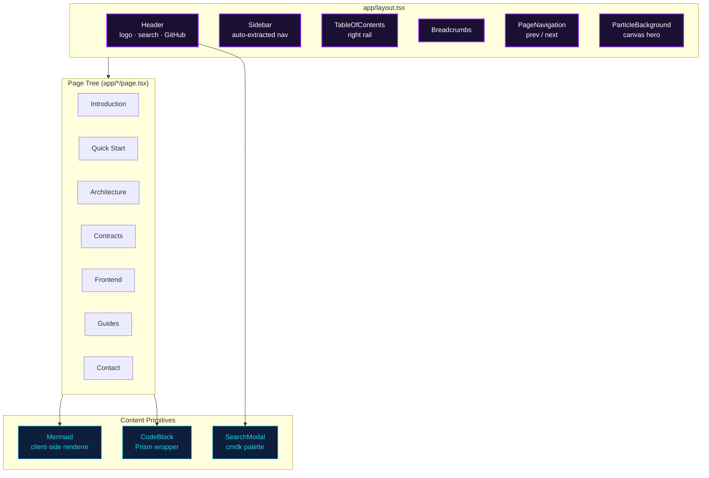
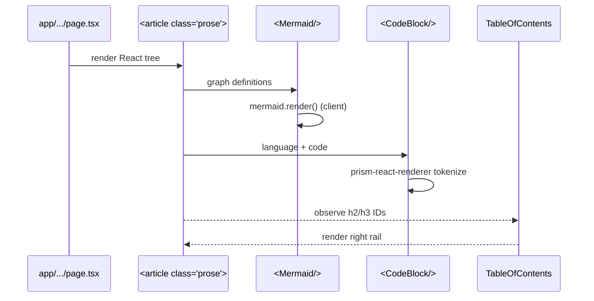
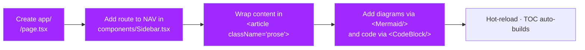
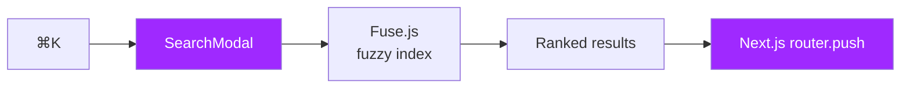

<div align="center">

# `docs_rupiahrote` — RupiahRoute Documentation

**The developer-facing documentation site for RupiahRoute.**
Hand-crafted Next.js site with an auto-generated sidebar, right-hand Table of
Contents, command-palette search, Mermaid diagrams, and Prism-highlighted code.

[🌐 Live](https://docsrupiahroute.vercel.app/) &nbsp;•&nbsp;
[🚀 dApp](https://rupiahroute-apps.vercel.app/) &nbsp;•&nbsp;
[🏠 Landing](../landing_page_rp/) &nbsp;•&nbsp;
[🔗 Contracts](../sc_RupiahRote/)

</div>

---

## Table of Contents

1. [Tech Stack](#tech-stack)
2. [Site Architecture](#site-architecture)
3. [Page Map](#page-map)
4. [Content Rendering Pipeline](#content-rendering-pipeline)
5. [Getting Started](#getting-started)
6. [Editing Content](#editing-content)
7. [Writing Diagrams](#writing-diagrams)
8. [Code Blocks & Syntax Highlighting](#code-blocks--syntax-highlighting)
9. [Search](#search)
10. [Project Structure](#project-structure)
11. [NPM Scripts](#npm-scripts)

---

## Tech Stack

| Layer | Technology | Version |
|-------|------------|---------|
| Framework | Next.js App Router | 16.2 |
| Language | TypeScript | 5.x |
| Runtime | React | 19.2 |
| Styling | Tailwind CSS v4 | 4.x |
| Diagrams | Mermaid.js | 11.x |
| Syntax | prism-react-renderer | 2.x |
| Search | Fuse.js + cmdk | 7 / 1 |
| Icons | lucide-react | 1.x |

---

## Site Architecture



---

## Page Map

```mermaid
graph LR
    ROOT[[/]] --> QS[/quickstart]
    ROOT --> ARCH[/architecture]
    ROOT --> CON[/contact]
    ROOT --> CONTRACTS[/contracts]
    CONTRACTS --> CR[/contracts/router]
    CONTRACTS --> CF[/contracts/faucet]
    CONTRACTS --> CD[/contracts/deployment]
    ROOT --> FE[/frontend]
    FE --> FSW[/frontend/swap]
    FE --> FFE[/frontend/features]
    FE --> FW[/frontend/wallet]
    ROOT --> GUIDES[/guides]
    GUIDES --> GT[/guides/tokens]
    GUIDES --> GD[/guides/dex]
    GUIDES --> GI[/guides/initia]

    classDef home fill:#9f29ff,color:#fff
    classDef section fill:#2a1a4a,color:#fff,stroke:#a78bfa
    class ROOT home
    class CONTRACTS,FE,GUIDES section
```

| Route | Section | What it covers |
|-------|---------|----------------|
| `/` | Intro | Mission, key features, supported tokens, project map |
| `/quickstart` | Onboarding | Step-by-step local setup: rollup → deploy → run UI |
| `/architecture` | Architecture | System diagram, data flow, frontend layers, state |
| `/contracts` | Contracts | Overview of `sc_RupiahRote` |
| `/contracts/router` | Contracts | `RupiahRouter` — AMM, routing, limits, batch |
| `/contracts/faucet` | Contracts | `TokenFaucet` — testnet utility hub |
| `/contracts/deployment` | Contracts | Foundry scripts, addresses, deployment notes |
| `/frontend` | Frontend | dApp overview + tech stack + component catalogue |
| `/frontend/swap` | Frontend | Swap layout, route generation, DEX quote pipeline |
| `/frontend/features` | Frontend | Limit / batch / bridge / send / faucet / dashboard |
| `/frontend/wallet` | Frontend | Wallet connection, wagmi config, anti-auto-connect |
| `/guides/tokens` | Guides | Supported token list with addresses + decimals |
| `/guides/dex` | Guides | External DEX aggregator comparison |
| `/guides/initia` | Guides | Initia chain integration notes |
| `/contact` | Misc | Contact / community |

---

## Content Rendering Pipeline



Pages are **plain `.tsx`** files — each exports a default React component
returning `<article className="prose">…</article>`. No MDX, no CMS, no build
step beyond Next.js.

---

## Getting Started

```bash
cd docs_rupiahrote
npm install
npm run dev          # → http://localhost:3000
```

> Port conflicts with `fe_rupiahrote` / `landing_page_rp` — stop others or
> pass `-- -p 3001`.

---

## Editing Content



1. Create a file at `app/<section>/page.tsx` (or a leaf like
   `app/<section>/<sub>/page.tsx`).
2. Register the route in the `NAV` array in
   [`app/components/Sidebar.tsx`](./app/components/Sidebar.tsx).
3. Write the body as a React component returning
   `<article className="prose">`.
4. Give section headings `id` attributes (or use the site's heading helpers)
   so the right-hand Table of Contents can link to them.

---

## Writing Diagrams

Use the `<Mermaid/>` client component for flowcharts, sequence diagrams, state
machines, and mind maps:

```tsx
import { Mermaid } from "../components/Mermaid";

<Mermaid chart={`graph TB
  A --> B
  B --> C
`} />
```

Because `<Mermaid/>` renders client-side, it is safe to use inside Server
Components — the wrapper itself is a `"use client"` boundary.

For **layout-style diagrams** (styled boxes, explicit colors, step rails),
prefer plain JSX inside a `not-prose` block — see any existing architecture
page for the pattern.

---

## Code Blocks & Syntax Highlighting

Use the `<CodeBlock/>` component to get Prism highlighting, copy-to-clipboard,
and consistent theme colors:

```tsx
import { CodeBlock } from "../components/CodeBlock";

<CodeBlock language="solidity">{`
function swap(uint256 poolId, address tokenIn, uint256 amountIn, uint256 minOut)
    external returns (uint256 amountOut);
`}</CodeBlock>
```

Supported languages include Solidity, TypeScript, Bash, JSON, and YAML (any
Prism-supported grammar works).

---

## Search



Press <kbd>⌘</kbd>+<kbd>K</kbd> (or <kbd>Ctrl</kbd>+<kbd>K</kbd>) to open the
command palette. The index is built from the page titles and headings
registered in `Sidebar.tsx`, scored via Fuse.js.

---

## Project Structure

```
docs_rupiahrote/
├── app/
│   ├── layout.tsx                 # Header · Sidebar · TOC · shell
│   ├── globals.css                # Tailwind v4 + theme tokens
│   ├── page.tsx                   # / — Introduction
│   ├── quickstart/page.tsx        # /quickstart
│   ├── architecture/page.tsx      # /architecture
│   ├── contact/page.tsx           # /contact
│   ├── contracts/
│   │   ├── page.tsx
│   │   ├── router/page.tsx
│   │   ├── faucet/page.tsx
│   │   └── deployment/page.tsx
│   ├── frontend/
│   │   ├── page.tsx
│   │   ├── swap/page.tsx
│   │   ├── features/page.tsx
│   │   └── wallet/page.tsx
│   └── guides/
│       ├── tokens/page.tsx
│       ├── dex/page.tsx
│       └── initia/page.tsx
├── app/components/
│   ├── Header.tsx                 # Top nav, logo, search trigger
│   ├── Sidebar.tsx                # Left nav — NAV array of sections
│   ├── TableOfContents.tsx        # Right rail TOC (heading observer)
│   ├── Breadcrumbs.tsx            # Section > page trail
│   ├── PageNavigation.tsx         # Prev / next links
│   ├── SearchModal.tsx            # cmdk palette + Fuse.js
│   ├── Mermaid.tsx                # Client-side Mermaid renderer
│   ├── CodeBlock.tsx              # Prism-powered code block
│   └── ParticleBackground.tsx     # Canvas particle effect for hero
├── lib/                           # Shared helpers / content index
└── public/
    └── logo.png                   # RupiahRoute logo
```

---

## NPM Scripts

| Command | Description |
|---------|-------------|
| `npm run dev` | Start Next.js dev server on `:3000` |
| `npm run build` | Production build |
| `npm run start` | Serve the production build |
| `npm run lint` | ESLint via flat config |

---

<div align="center">

Part of the [RupiahRoute monorepo](../).

</div>
