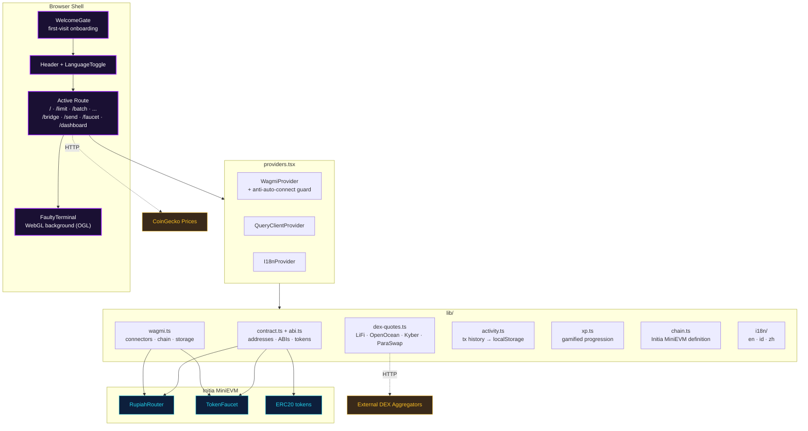
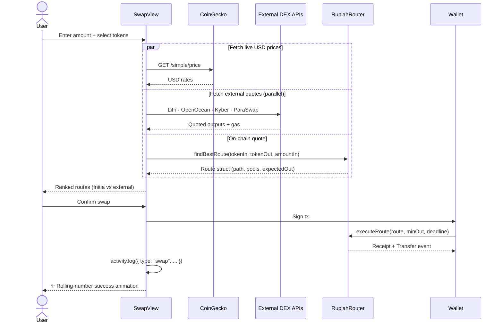
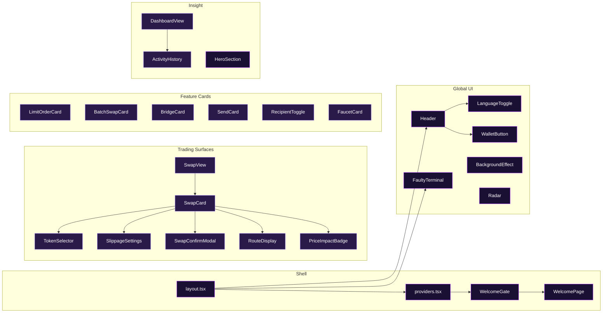
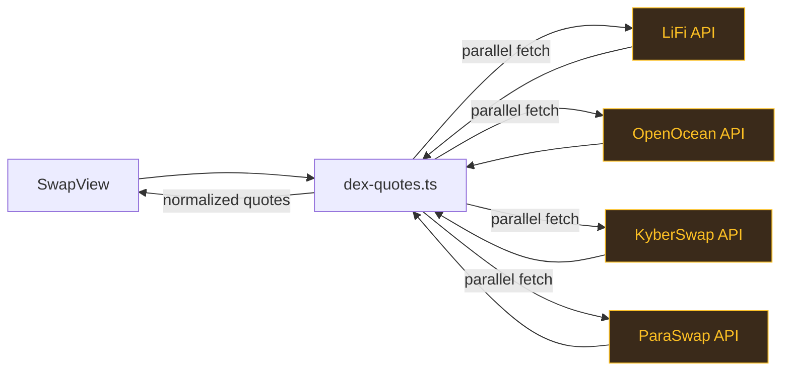
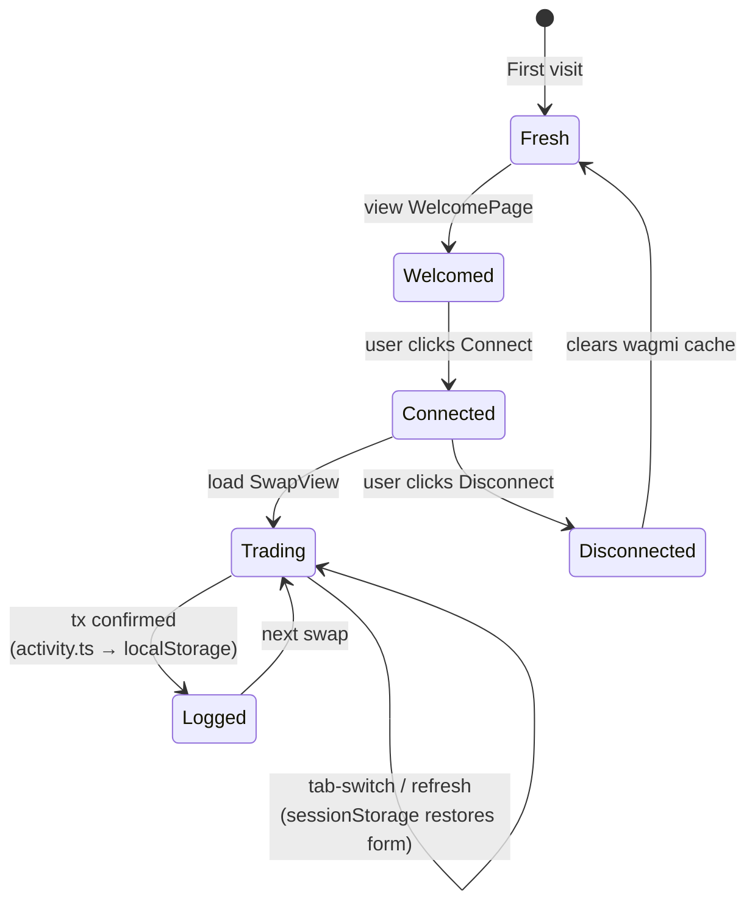

<div align="center">

# `fe_rupiahrote` — RupiahRoute dApp

**The production web interface for RupiahRoute.**
Smart swap, on-chain limit orders, batch rebalancing, bridge, username send,
faucet, and portfolio dashboard — all in one Next.js 16 application.

[🌐 Live](https://rupiahroute-apps.vercel.app/) &nbsp;•&nbsp;
[📘 Docs](https://docsrupiahroute.vercel.app/) &nbsp;•&nbsp;
[🏠 Landing](../landing_page_rp/) &nbsp;•&nbsp;
[🔗 Contracts](../sc_RupiahRote/)

</div>

---

## Table of Contents

1. [Tech Stack](#tech-stack)
2. [Pages](#pages)
3. [Application Architecture](#application-architecture)
4. [Data Flow — Smart Swap](#data-flow--smart-swap)
5. [Component Map](#component-map)
6. [Library Layer](#library-layer)
7. [State Persistence](#state-persistence)
8. [Key Features Explained](#key-features-explained)
9. [Environment Variables](#environment-variables)
10. [Getting Started](#getting-started)
11. [Project Structure](#project-structure)
12. [NPM Scripts](#npm-scripts)

---

## Tech Stack

| Layer | Technology | Version |
|-------|------------|---------|
| Framework | Next.js App Router | 16.2 |
| Language | TypeScript | 5.x |
| UI | React | 19.2 |
| Styling | Tailwind CSS v4 + shadcn/ui | 4.x |
| Blockchain | wagmi + viem | 3.6 / 2.47 |
| Data | @tanstack/react-query | 5.x |
| 3D / Shaders | Three.js · R3F · Drei · OGL | latest |
| Animation | framer-motion | 12.x |
| i18n | i18next + react-i18next | 26 / 17 |
| Wallet | WalletConnect v2 + injected connectors | 2.23 |

> **Design language:** cyberpunk retro — pixel heading font (*Press Start 2P*),
> CJK-aware body font (*Noto Sans SC*), WebGL “faulty terminal” background, and
> a signature `#9f29ff` purple glow.

---

## Pages

| Route | Component | Description |
|-------|-----------|-------------|
| `/` | `SwapView` | Smart swap with 4-DEX comparison and 3D globe hero |
| `/limit` | `LimitOrderCard` | Place on-chain limit orders with target price + expiry |
| `/batch` | `BatchSwapCard` | Allocate % across multiple tokens in one atomic tx |
| `/bridge` | `BridgeCard` | Deposit/withdraw between Initia L1 and the appchain |
| `/send` | `SendCard` | Send tokens to `.init` usernames or hex addresses |
| `/faucet` | `FaucetCard` | Claim testnet tokens (INIT, USDC, WETH, TIA, IDRX) |
| `/dashboard` | `DashboardView` | Portfolio balances, activity history, tx breakdown |

---

## Application Architecture



---

## Data Flow — Smart Swap



---

## Component Map



The frontend ships **25+ React components**. Highlights:

| Component | Responsibility |
|-----------|----------------|
| `SwapView` | Main trading surface — form, quotes, comparison, 3D globe |
| `WalletButton` | Connect/disconnect with anti-auto-connect guard |
| `TokenSelector` | Multi-chain picker powered by the Uniswap token list |
| `FaultyTerminal` | WebGL background shader (OGL) — purple, low opacity |
| `WelcomePage` | First-visit onboarding with animated feature highlights |
| `RouteDisplay` | Visualizes hops, pools, and protocol badges for a route |
| `Radar` | Ambient sweeping radar overlay, pure CSS/SVG |

---

## Library Layer

```
lib/
├── abi.ts              ← Canonical ABIs (router + faucet + ERC20)
├── abis.ts             ← Legacy/alias export for compatibility
├── activity.ts         ← Tx history persisted to localStorage
├── chain.ts            ← Initia MiniEVM chain definition
├── contract.ts         ← Deployed addresses, token metadata, helpers
├── dex-quotes.ts       ← HTTP clients for 4 external DEX aggregators
├── i18n/               ← en.ts · id.ts · zh.ts translation catalogs
├── tokens.ts           ← Curated token list + icons
├── uniswap-tokens.ts   ← Imported Uniswap default-list for cross-chain UX
├── utils.ts            ← cn(), formatters, clsx helpers
├── wagmi.ts            ← Connectors, storage, project ID
└── xp.ts               ← Gamified XP rules (levels, badges)
```

### DEX Aggregator Integration



Each aggregator is called in parallel; failures are swallowed so slow APIs
never block the UI. Results are normalized into a common `Quote` shape for
ranking alongside the on-chain route.

---

## State Persistence



| Storage | Key | Content |
|--------|-----|---------|
| `sessionStorage` | `rr:swap-form` | In-flight tokens, amounts, slippage |
| `localStorage` | `rr:activity` | Full tx history (type-tagged) |
| `localStorage` | `rr:welcomed` | Flag to skip the Welcome screen |
| `localStorage` | `wagmi.*` | Wallet connector + reconnect flag |

---

## Key Features Explained

| Feature | Implementation Notes |
|---------|----------------------|
| **Smart Route Comparison** | Ranks the on-chain `findBestRoute` result against 4 external DEX aggregators; highlights the winner with a glowing badge. |
| **Anti-Auto-Connect Guard** | Rejects silent reconnect from aggressive wallets (e.g. Talisman) unless the user previously clicked Connect in this origin. |
| **Rolling Number Animation** | Output amount slides down and digit-counts up whenever the quote changes; auto-scales font when the integer part overflows. |
| **FaultyTerminal Background** | OGL shader with scanlines, glitch, noise; tinted `#9f29ff` at low opacity. Disabled on low-power devices via `prefers-reduced-motion`. |
| **Localized Rich Content** | Translations cover not only labels but also tooltips, empty states, and error surfaces across three languages. |
| **Activity History** | Every write (swap, limit, batch, bridge, send, faucet) is tagged with metadata (mode, expiry, allocations) so the dashboard can reconstruct intent, not just tx hashes. |

---

## Environment Variables

Create `.env.local` from the template and fill in:

```bash
NEXT_PUBLIC_WC_PROJECT_ID=            # WalletConnect Cloud project ID
NEXT_PUBLIC_ROUTER_CONTRACT=          # Deployed RupiahRouter address
NEXT_PUBLIC_FAUCET_CONTRACT=          # Deployed TokenFaucet address
NEXT_PUBLIC_USE_LOCAL_ROLLUP=true     # Point wagmi at http://localhost:8545
```

> Contract addresses are produced when you deploy from
> [`sc_RupiahRote/`](../sc_RupiahRote/). See its README for deployment scripts.

---

## Getting Started

```bash
# 1. Install deps
npm install

# 2. Configure env
cp .env.example .env.local
# → fill NEXT_PUBLIC_ROUTER_CONTRACT + NEXT_PUBLIC_FAUCET_CONTRACT

# 3. Run dev server
npm run dev
# → http://localhost:3000
```

> **Prerequisite:** an Initia MiniEVM node running at `http://localhost:8545`
> with the RupiahRoute contracts deployed. See
> [`../sc_RupiahRote/README.md`](../sc_RupiahRote/README.md).

---

## Project Structure

```
fe_rupiahrote/
├── app/                        # Next.js App Router
│   ├── layout.tsx              # Root HTML shell + providers
│   ├── providers.tsx           # Wagmi + React Query + i18n
│   ├── globals.css             # Tailwind v4 + design tokens
│   ├── page.tsx                # / — Swap
│   ├── limit/page.tsx          # /limit
│   ├── batch/page.tsx          # /batch
│   ├── bridge/page.tsx         # /bridge
│   ├── send/page.tsx           # /send
│   ├── faucet/page.tsx         # /faucet
│   └── dashboard/page.tsx      # /dashboard
├── components/                 # 25+ React components
│   ├── ui/                     # shadcn primitives (button, globe, ...)
│   ├── SwapView.tsx            # Main swap surface
│   ├── SwapCard.tsx            # Form card used inside SwapView
│   ├── TokenSelector.tsx       # Multi-chain token picker
│   ├── RouteDisplay.tsx        # Route visualization
│   ├── LimitOrderCard.tsx      # /limit card
│   ├── BatchSwapCard.tsx       # /batch card
│   ├── BridgeCard.tsx          # /bridge card
│   ├── SendCard.tsx            # /send card
│   ├── FaucetCard.tsx          # /faucet card
│   ├── DashboardView.tsx       # /dashboard view
│   ├── ActivityHistory.tsx     # Transaction feed
│   ├── WalletButton.tsx        # Connect/disconnect + guard
│   ├── WelcomeGate.tsx         # First-visit gate
│   ├── WelcomePage.tsx         # Onboarding screen
│   ├── FaultyTerminal.tsx      # OGL WebGL background
│   ├── BackgroundEffect.tsx    # Secondary ambient background
│   ├── Radar.tsx               # Ambient SVG radar
│   ├── Header.tsx              # Top nav
│   ├── HeroSection.tsx         # Landing hero (home)
│   └── LanguageToggle.tsx      # EN / ID / ZH dropdown
├── lib/                        # Business logic + config
│   ├── contract.ts · abi.ts · abis.ts
│   ├── wagmi.ts · chain.ts
│   ├── dex-quotes.ts
│   ├── activity.ts · xp.ts
│   ├── tokens.ts · uniswap-tokens.ts
│   ├── utils.ts
│   └── i18n/{en,id,zh}.ts
└── public/                     # Logo + static assets
```

---

## NPM Scripts

| Script | Description |
|--------|-------------|
| `npm run dev` | Start Next.js dev server on `:3000` |
| `npm run build` | Production build (`.next/`) |
| `npm run start` | Serve the production build |
| `npm run lint` | ESLint (flat config via `eslint.config.mjs`) |

---

<div align="center">

Built with 💜 for the Initia ecosystem.

</div>
