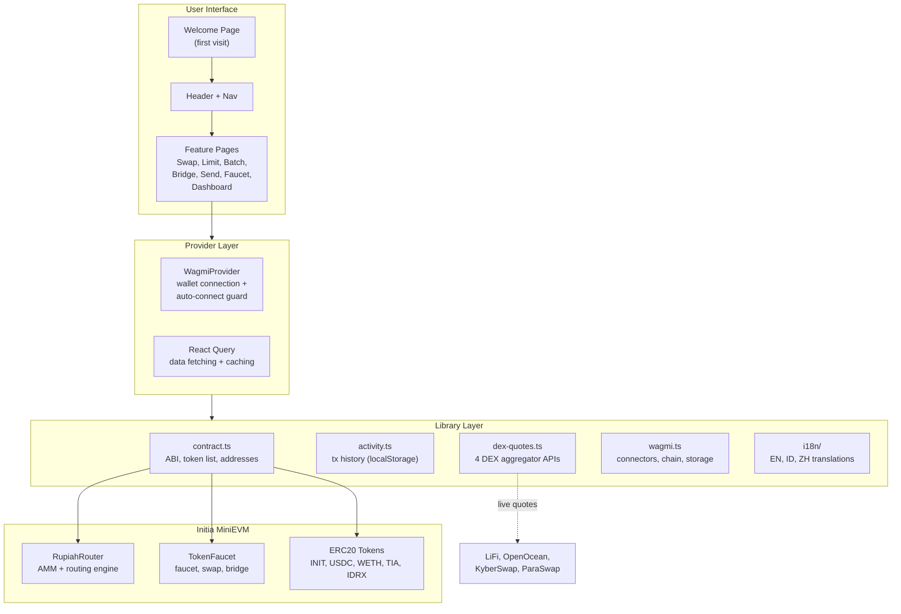
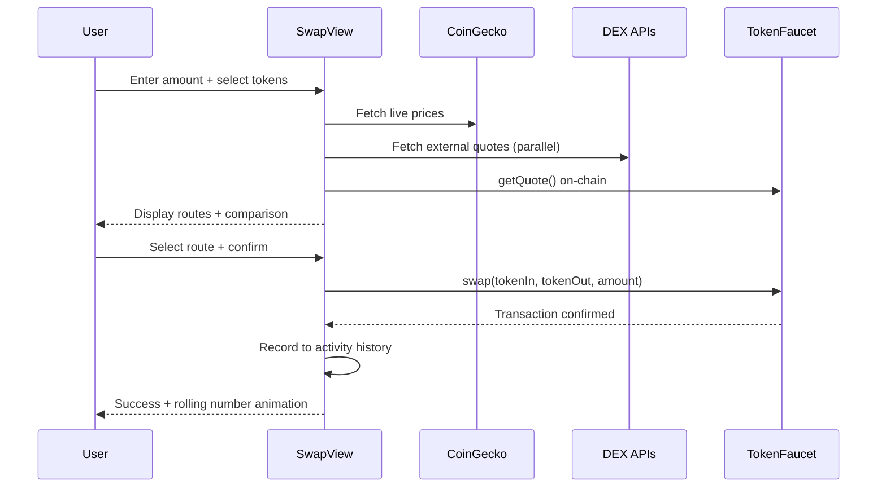

# RupiahRoute Frontend

The web interface for RupiahRoute — a smart DeFi router built on Initia. Next.js 16, wagmi, Tailwind CSS v4, cyberpunk retro theme with Press Start 2P pixel font.

## Tech Stack

| Layer | Technology |
|-------|-----------|
| Framework | Next.js 16.2.2 (App Router) |
| Language | TypeScript 5 |
| Blockchain | wagmi 3.6 + viem 2.47 |
| Styling | Tailwind CSS v4 + shadcn/ui |
| State | React Query (TanStack) |
| 3D | Three.js + React Three Fiber + OGL |
| i18n | i18next (EN, ID, ZH) |
| Font | Press Start 2P (pixel) + Noto Sans SC (CJK) |

## Pages

| Route | Component | Description |
|-------|-----------|-------------|
| `/` | SwapView | Smart swap with route comparison and 3D globe |
| `/limit` | LimitOrderCard | On-chain limit orders with target price and expiry |
| `/batch` | BatchSwapCard | Multi-token rebalancing in one transaction |
| `/bridge` | BridgeCard | Deposit/withdraw between Initia L1 and appchain |
| `/send` | SendCard | Send tokens to .init usernames or hex addresses |
| `/faucet` | FaucetCard | Claim testnet tokens (INIT, USDC, WETH, TIA, IDRX) |
| `/dashboard` | DashboardView | Portfolio balances, activity history, transaction stats |

## Architecture



## Data Flow — Swap



## Key Features

- **Smart Route Comparison** — Initia ecosystem routes vs 4 external DEX aggregators with live CoinGecko prices
- **Anti-Auto-Connect** — Prevents wallets like Talisman from auto-connecting; only reconnects when user explicitly connected
- **State Persistence** — Swap form (tokens, amount, slippage) survives tab switches via sessionStorage
- **Activity Tracking** — All transaction types logged with per-type metadata (bridge mode, limit expiry, batch allocations)
- **Rolling Number Animation** — Output values slide in from above when changing; auto-size for long numbers
- **FaultyTerminal Background** — WebGL animated terminal shader via OGL, purple-tinted, subtle opacity
- **Welcome Page** — First-visit onboarding with feature highlights and animated entrance

## Project Structure

```
fe_rupiahrote/
├── app/                    # Next.js pages + layout + providers + CSS
├── components/             # 25+ React components
│   ├── ui/                 # shadcn base (button, globe)
│   ├── SwapView.tsx        # Main swap interface (largest)
│   ├── WalletButton.tsx    # Wallet connection + auto-connect guard
│   ├── TokenSelector.tsx   # Multi-chain token picker with Uniswap list
│   ├── FaultyTerminal.tsx  # WebGL background (OGL shader)
│   └── WelcomePage.tsx     # First-visit onboarding screen
├── lib/                    # Business logic + config
│   ├── contract.ts         # Addresses, ABI, token definitions
│   ├── wagmi.ts            # Wallet connectors + chain config
│   ├── dex-quotes.ts       # 4 DEX aggregator API integration
│   ├── activity.ts         # Transaction history (localStorage)
│   └── i18n/               # Translations (en.ts, id.ts, zh.ts)
└── public/                 # Logo + static assets
```

## Environment Variables

```bash
NEXT_PUBLIC_WC_PROJECT_ID=          # WalletConnect project ID
NEXT_PUBLIC_ROUTER_CONTRACT=        # RupiahRouter deployed address
NEXT_PUBLIC_FAUCET_CONTRACT=        # TokenFaucet deployed address
NEXT_PUBLIC_USE_LOCAL_ROLLUP=true   # Set when local rollup is running
```

## Getting Started

```bash
npm install
npm run dev       # http://localhost:3000
```

Requires an Initia MiniEVM node running at `http://localhost:8545` with deployed contracts. See the [smart contract README](../sc_RupiahRote/README.md) for deployment instructions.
