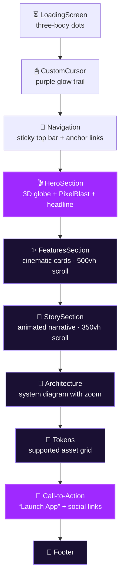
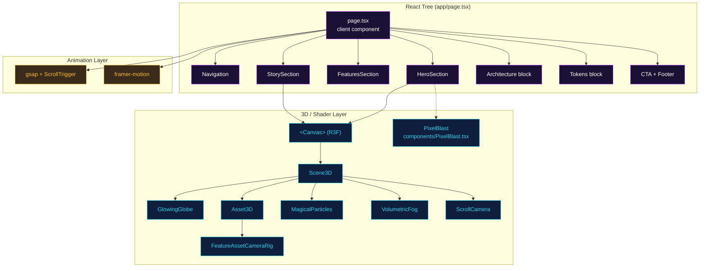
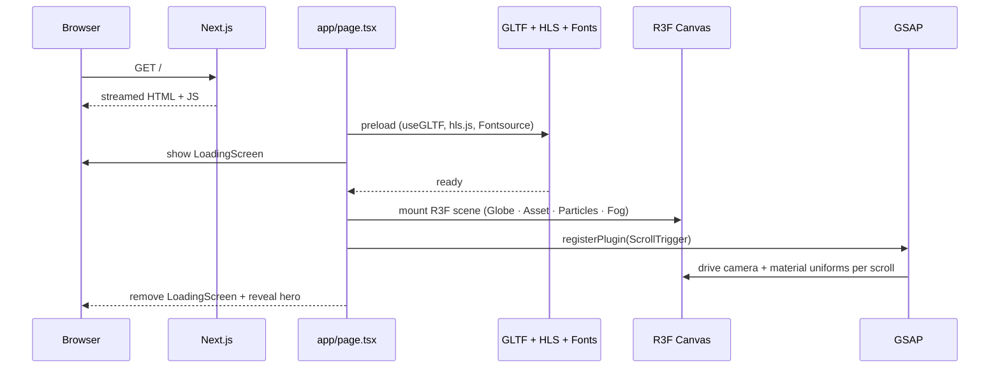
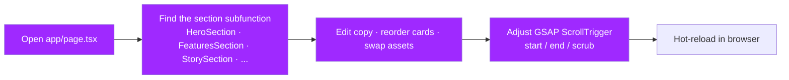
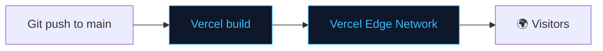

<div align="center">

# `landing_page_rp` — RupiahRoute Landing Page

**The public marketing site for RupiahRoute.**
A cinematic, scroll-driven single-page experience built with Next.js 16,
React Three Fiber, GSAP ScrollTrigger, and Framer Motion — designed to drive
visitors from "what is this?" to "**Launch App**" in under thirty seconds.

[🌐 Live](https://rupiahroute-apps.vercel.app/) &nbsp;•&nbsp;
[🚀 dApp](https://rupiahroute-apps.vercel.app/) &nbsp;•&nbsp;
[📘 Docs](https://docsrupiahroute.vercel.app/) &nbsp;•&nbsp;
[🔗 Contracts](../sc_RupiahRote/)

</div>

---

## Table of Contents

1. [Tech Stack](#tech-stack)
2. [Page Anatomy](#page-anatomy)
3. [Scroll Timeline](#scroll-timeline)
4. [Visual Architecture](#visual-architecture)
5. [Rendering Pipeline](#rendering-pipeline)
6. [Call-to-Action Flow](#call-to-action-flow)
7. [Performance Notes](#performance-notes)
8. [Getting Started](#getting-started)
9. [Customizing Content](#customizing-content)
10. [Project Structure](#project-structure)
11. [Deployment](#deployment)
12. [NPM Scripts](#npm-scripts)

---

## Tech Stack

| Layer | Technology | Version |
|-------|------------|---------|
| Framework | Next.js App Router | 16.2 |
| Language | TypeScript | 5.x |
| Runtime | React | 19.2 |
| 3D | Three.js + React Three Fiber + Drei | latest |
| Post-processing | `postprocessing` | 6.x |
| Shaders | Custom GLSL + `PixelBlast` | — |
| Scroll animation | GSAP + ScrollTrigger | 3.x |
| Micro-interactions | framer-motion | 12.x |
| Styling | Tailwind CSS v4 | 4.x |
| Video | hls.js (cinematic reels) | 1.x |
| Fonts | Instrument Serif + Inter | Fontsource |

---

## Page Anatomy

The landing is a **single scroll-locked document** composed of the following
sections, rendered in order:



| # | Section | Behavior |
|---|---------|----------|
| 1 | **LoadingScreen** | Three-body pulsing dots while assets preload |
| 2 | **CustomCursor** | Replaces native cursor with a glowing pointer |
| 3 | **Navigation** | Sticky top bar with anchors: Features · Architecture · Tokens |
| 4 | **HeroSection** | Full-viewport R3F globe + GLSL `PixelBlast` background |
| 5 | **FeaturesSection** | 500vh scroll-pinned reel of cinematic feature cards |
| 6 | **StorySection** | 350vh narrative with glitch text + volumetric fog |
| 7 | **Architecture** | Interactive system view (zoom on scroll) |
| 8 | **Tokens** | Curated grid of supported assets |
| 9 | **CTA** | Final “**Launch App**” button → redirects to the dApp |
| 10 | **Footer** | Social + copyright |

---

## Scroll Timeline

```mermaid
gantt
    dateFormat X
    axisFormat %L
    title Scroll-driven timeline (progress 0 → 1)

    section Hero
    Globe intro + headline       :0, 10
    Camera pull-back             :10, 18

    section Features (500vh pin)
    Card 1 reveal                :18, 26
    Card 2 reveal                :26, 34
    Card 3 reveal                :34, 42
    Card 4 reveal                :42, 50

    section Story (350vh pin)
    Glitch text + fog            :50, 62
    Asset 3D zoom                :62, 72

    section Architecture
    System graph zoom-in         :72, 82

    section Tokens + CTA
    Token grid                   :82, 90
    Launch App CTA               :90, 100
```



Each “act” is wired to GSAP ScrollTrigger — pinned sections keep the camera
stationary while the narrative advances, then release the scroll once the
internal timeline completes.

---

## Visual Architecture



---

## Rendering Pipeline



---

## Call-to-Action Flow

```mermaid
flowchart LR
    V[👤 Visitor arrives at /] --> R[Reads hero + story]
    R --> F[Scrolls through features]
    F --> T[Sees token grid]
    T --> CTA{{Launch App button}}
    CTA -- target="_blank" --> APP[[rupiahroute-apps.vercel.app]]
    CTA -. secondary .-> DOCS[[docsrupiahroute.vercel.app]]

    classDef cta fill:#9f29ff,color:#fff,stroke:#b44dff,stroke-width:2px
    classDef ext fill:#22c55e,color:#fff
    class CTA cta
    class APP,DOCS ext
```

The **Launch App** CTA is an `<a>` opening the dApp in a new tab. The
secondary “Learn more” link points to the docs site.

---

## Performance Notes

- `LoadingScreen` stays mounted until `useGLTF` resolves + fonts are ready;
  prevents FOUC and first-frame jank.
- `CustomCursor` is disabled automatically on touch devices.
- GSAP `ScrollTrigger.refresh()` is called on resize to keep timelines in
  sync with the viewport.
- The R3F canvas uses a single `<Canvas>` reused across sections via
  `<ScrollCamera/>` — no per-section canvases.
- `PixelBlast` shader runs at a modest pixel ratio and respects
  `prefers-reduced-motion`.

---

## Getting Started

```bash
cd landing_page_rp
npm install
npm run dev          # → http://localhost:3000
```

> Port conflicts with the other Next.js packages — stop them or start with
> `npm run dev -- -p 3100`.

---

## Customizing Content



- Each on-page section is a **subfunction** inside `app/page.tsx`
  (`HeroSection`, `FeaturesSection`, `StorySection`, etc.).
- Tweak copy directly in JSX — no CMS.
- The CTA target URL lives on the `motion.a` for the “Launch App” button
  near the bottom of `app/page.tsx`.

---

## Project Structure

```
landing_page_rp/
├── app/
│   ├── layout.tsx               # Root layout + font loading
│   ├── page.tsx                 # Entire landing experience (client)
│   ├── globals.css              # Tailwind v4 + design tokens
│   └── favicon.ico
├── components/
│   └── PixelBlast.tsx           # GLSL pixel-blast shader background
├── public/                      # Static assets (logo, videos, GLTF)
├── eslint.config.mjs            # Flat-config ESLint
├── next.config.ts               # Next.js config
├── postcss.config.mjs           # Tailwind v4 PostCSS plugin
└── tsconfig.json                # TypeScript config
```

> `app/page.tsx` is intentionally a single large client component — the
> scroll timelines share refs and GSAP contexts that benefit from colocation.

---

## Deployment



Designed for **Vercel**. Zero-config deploy:

1. Import the repo into Vercel.
2. Set the root directory to `landing_page_rp/`.
3. Framework preset: Next.js. Build command / output: default.
4. Optional custom domain.

---

## NPM Scripts

| Command | Description |
|---------|-------------|
| `npm run dev` | Start Next.js dev server on `:3000` |
| `npm run build` | Production build |
| `npm run start` | Serve the production build |
| `npm run lint` | ESLint via flat config |

---

<div align="center">

The entry point to the RupiahRoute experience — part of the
[RupiahRoute monorepo](../).

</div>
