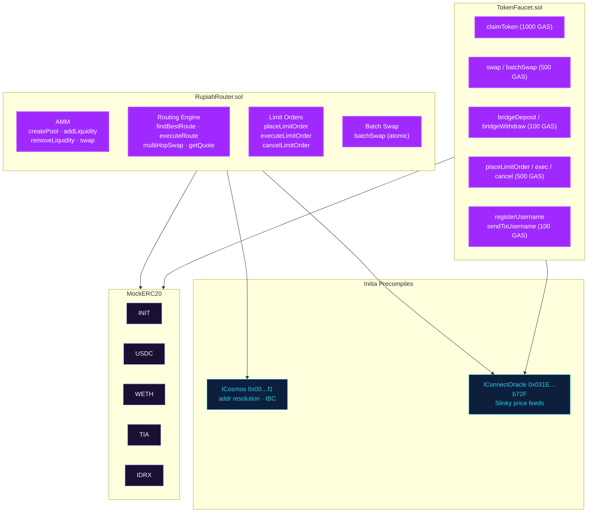
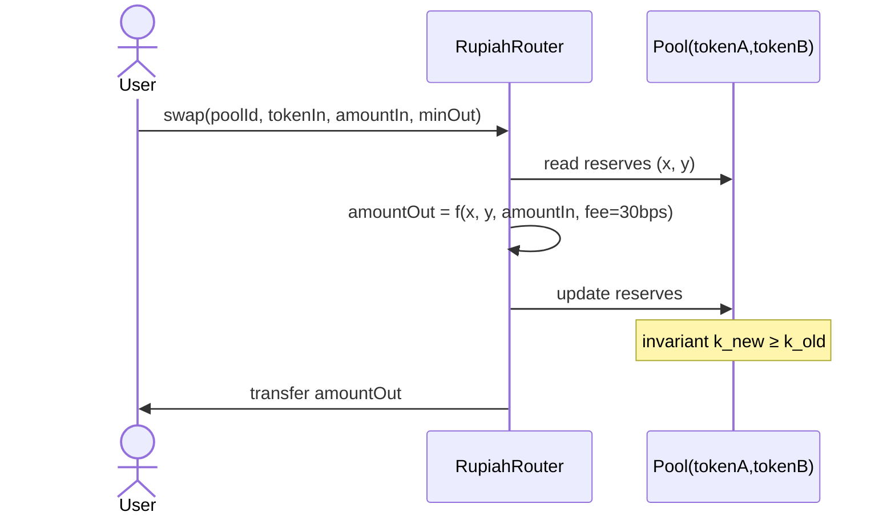
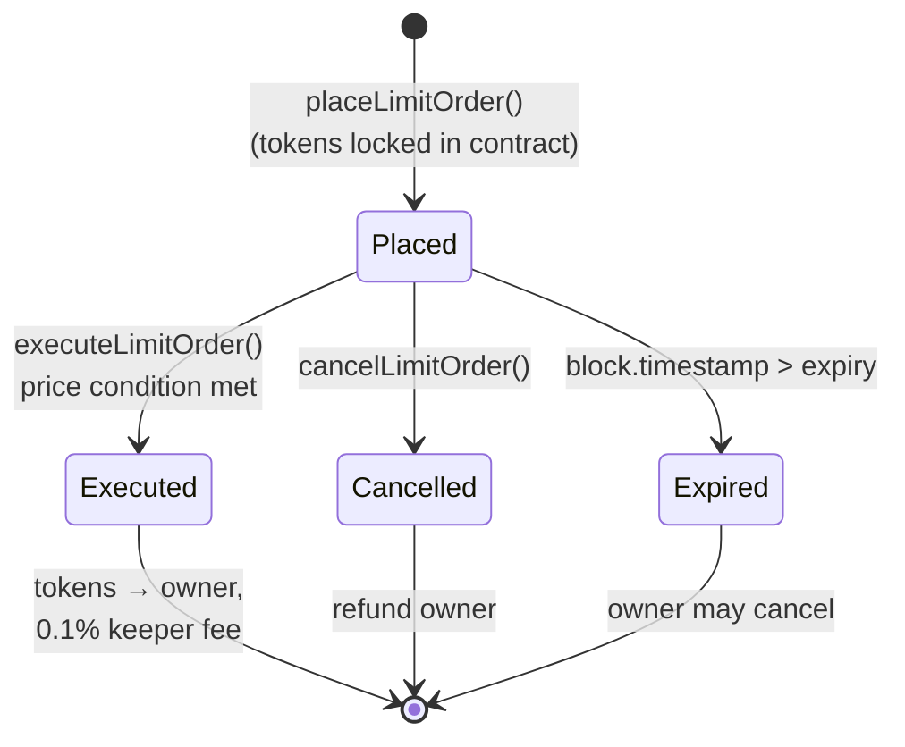
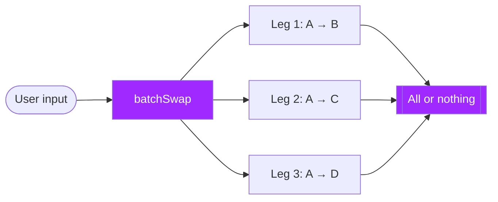
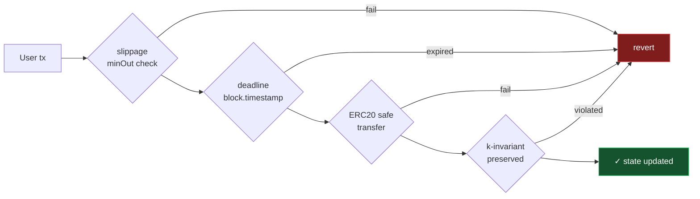
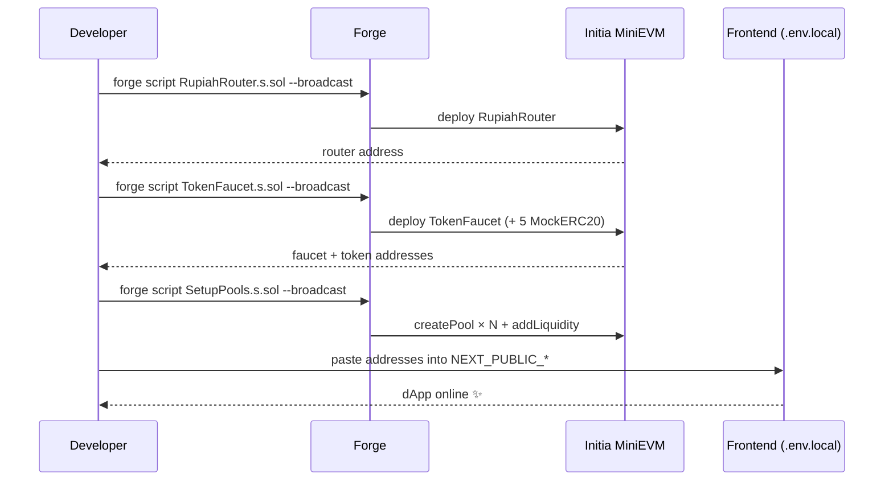

<div align="center">

# `sc_RupiahRote` — RupiahRoute Smart Contracts

**Solidity contracts powering the RupiahRoute routing engine on Initia MiniEVM.**
A single unified contract provides the AMM, the routing engine, limit orders
and batch swaps — with cross-VM hooks into Initia’s Cosmos precompiles.

[🔗 Frontend](../fe_rupiahrote/) &nbsp;•&nbsp;
[📘 Docs](https://docsrupiahroute.vercel.app/) &nbsp;•&nbsp;
[🏠 Landing](../landing_page_rp/)

</div>

---

## Table of Contents

1. [Tech Stack](#tech-stack)
2. [Contract Inventory](#contract-inventory)
3. [High-level Architecture](#high-level-architecture)
4. [Core Mechanics](#core-mechanics)
    - [AMM (x · y = k)](#amm-x--y--k)
    - [Smart Routing](#smart-routing)
    - [Limit Orders](#limit-orders)
    - [Batch Swap](#batch-swap)
    - [TokenFaucet (Testnet)](#tokenfaucet-testnet)
5. [Initia Precompiles](#initia-precompiles)
6. [Key Parameters](#key-parameters)
7. [Security Model](#security-model)
8. [Development Workflow](#development-workflow)
9. [Deployment](#deployment)
10. [Environment Variables](#environment-variables)
11. [Project Structure](#project-structure)

---

## Tech Stack

| Tool | Version |
|------|---------|
| Solidity | `0.8.24` |
| Framework | Foundry (Forge + Cast + Anvil) |
| EVM Target | `paris` (Initia MiniEVM-compatible) |
| Optimizer | enabled, 200 runs |
| Interfaces | `forge-std`, Initia Cosmos/Slinky precompiles |

---

## Contract Inventory

| Contract | Purpose | Size |
|----------|---------|------|
| **`RupiahRouter.sol`** | Core AMM + routing engine + limit orders + batch swap | ~1 file, monolithic by design |
| **`TokenFaucet.sol`** | Testnet utility hub: faucet + oracle-priced swap + bridge sim + username registry |  |
| **`MockERC20.sol`** | ERC20 with `mint` / `burn` for tests and seed liquidity |  |
| **`ICosmos.sol`** | Interface to the Initia Cosmos precompile (`0x00…f1`) |  |
| **`IConnectOracle.sol`** | Interface to the Slinky oracle precompile (`0x031E…b72F`) |  |

### Deployed Tokens (testnet)

| Symbol | Decimals | Faucet Amount | Notes |
|--------|----------|---------------|-------|
| INIT | 18 | 10,000 | Initia native |
| USDC | 6 | 10,000 | USD-pegged |
| WETH | 18 | 5 | Wrapped Ether |
| TIA | 6 | 10,000 | Celestia |
| IDRX | 2 | 100,000,000 | Indonesian Rupiah stablecoin |

---

## High-level Architecture



---

## Core Mechanics

### AMM (x · y = k)



- Constant-product reserves per pool
- Default swap fee: **0.3 % (30 bps)**, stored per-pool so future pools can
  override
- **Minimum liquidity** of 1000 is permanently locked on first deposit to
  prevent inflation attacks
- LP tokens minted proportional to contribution

### Smart Routing

```mermaid
flowchart LR
    IN((INIT)) -- Direct: Pool 1 --> OUT((USDC))
    IN -- Hop 1: Pool 2 --> H1((WETH))
    H1 -- Hop 2: Pool 3 --> OUT
    IN -- Hop 1: Pool 4 --> H2((TIA))
    H2 -- Hop 2: Pool 5 --> OUT

    classDef start fill:#9f29ff,color:#fff
    classDef end fill:#22c55e,color:#fff
    class IN start
    class OUT end
```

- `findBestRoute(tokenIn, tokenOut, amountIn)` compares **direct** vs
  **multi-hop** (up to `MAX_HOPS = 3`) and returns the `Route` with the highest
  expected output.
- `executeRoute(Route, minOut, deadline)` performs the swap with
  **slippage protection** and **deadline validation**.
- A small **protocol fee** (500 wei per `executeRoute`) covers operational
  costs; configurable by the owner.

### Limit Orders



- `tokenIn` is transferred and **held by the router** at placement time.
- Anyone can call `executeLimitOrder` (keeper pattern) — the executor earns a
  **0.1 % (10 bps) reward**.
- `expiry` is a unix timestamp enforced on-chain.

### Batch Swap

`batchSwap(BatchSwapParam[] calldata legs)` executes multiple independent
legs **atomically** in a single transaction — if any leg reverts, the entire
batch reverts. Used by the frontend `/batch` page for portfolio rebalancing.



### TokenFaucet (Testnet)

`TokenFaucet` is an **all-in-one testnet utility** — it serves faucet claims,
simulates bridges, holds its own swap/limit flows, and hosts a lightweight
username registry.

| Action | GAS Fee | Notes |
|--------|---------|-------|
| `claimToken` | 1,000 | Mints 10k of each test token |
| `swap` / `batchSwap` | 500 | Oracle-priced, 0.3 % protocol fee |
| `bridgeDeposit` / `bridgeWithdraw` | 100 | Simulated L1 ↔ L2 movement |
| `placeLimitOrder` / `execute` / `cancel` | 500 | Oracle-priced |
| `registerUsername` / `sendToUsername` | 100 | Local registry |

> Pricing inside `TokenFaucet` uses an internal USD-cent oracle (constructor-seeded
> and adjustable), letting the UI demo limit orders without a real price
> feed in local dev.

---

## Initia Precompiles

```mermaid
flowchart LR
    RR[RupiahRouter] -- resolve("alice.init") --> COS((Cosmos<br/>0x00…f1))
    COS -- 0xABCD...1234 --> RR
    RR -- getPrice("INIT/USD") --> ORA((Slinky Oracle<br/>0x031E…b72F))
    ORA -- 985000 (6dp) --> RR

    classDef pc fill:#0d1f3c,color:#22d3ee,stroke:#22d3ee
    class COS,ORA pc
```

- **`ICosmos`** → `DEFAULT_COSMOS = 0x…f1` — username resolution + IBC transfers.
  Injectable at construction time for devnets or alternate chains.
- **`IConnectOracle`** → `DEFAULT_ORACLE = 0x031E…b72F` — Slinky price feeds
  for oracle-priced limit orders and cross-token quoting.

---

## Key Parameters

| Parameter | Value | Where |
|-----------|-------|-------|
| `FEE_DENOMINATOR` | `10000` (basis points) | `RupiahRouter` |
| Default swap fee | `30` bps = 0.3 % | `Pool.swapFeeRate` |
| `LIMIT_ORDER_EXEC_FEE` | `10` bps = 0.1 % | `RupiahRouter` |
| Protocol fee per `executeRoute` | `500` wei | `RupiahRouter` |
| `MAX_HOPS` | `3` | `RupiahRouter` |
| `MINIMUM_LIQUIDITY` | `1000` (locked) | `RupiahRouter` |
| `CLAIM_FEE` | `1000 ether` | `TokenFaucet` |
| `SWAP_FEE` / `LIMIT_FEE` | `500 ether` | `TokenFaucet` |

---

## Security Model



| Layer | Mechanism |
|-------|-----------|
| Slippage | `minOut` parameters on every trade entrypoint |
| Replay / stale TX | `deadline` checked against `block.timestamp` |
| Privilege | `onlyOwner` for fee updates, withdrawals, oracle swap |
| Token transfers | Safe-wrapper checks return data on `transfer` / `transferFrom` |
| Invariants | `k_new ≥ k_old` after every pool swap |
| Locked units | 1000 MINIMUM_LIQUIDITY burned on first LP mint |

---

## Development Workflow


```bash
# Compile
forge build

# Run the test suite
forge test -vv

# Gas snapshot
forge snapshot
```

The test suite lives in [`test/RupiahRouter.t.sol`](./test/RupiahRouter.t.sol)
and exercises pool creation, swaps, multi-hop routing, limit orders, batch
execution, and guard conditions.

---

## Deployment



```bash
# 1. Deploy the router
forge script script/RupiahRouter.s.sol \
  --rpc-url $RPC_URL --private-key $DEPLOYER_KEY \
  --broadcast --legacy

# 2. Deploy the faucet (which deploys the 5 MockERC20s)
forge script script/TokenFaucet.s.sol \
  --rpc-url $RPC_URL --private-key $DEPLOYER_KEY \
  --broadcast --legacy

# 3. Seed pools and initial liquidity
forge script script/SetupPools.s.sol \
  --rpc-url http://localhost:8545 \
  --broadcast --legacy
```

> A helper `script/deploy.sh` runs the three steps in order for convenience.

---

## Environment Variables

```bash
DEPLOYER_KEY=       # Private key used by forge script
ROUTER_ADDRESS=     # Deployed RupiahRouter (consumed by SetupPools)
USER_ADDRESS=       # Optional: test user that receives seed tokens
RPC_URL=            # Initia MiniEVM RPC, e.g. http://localhost:8545
```

---

## Project Structure

```
sc_RupiahRote/
├── src/
│   ├── RupiahRouter.sol            # AMM + routing + limits + batch
│   ├── TokenFaucet.sol             # Testnet utility hub
│   ├── interfaces/
│   │   ├── ICosmos.sol             # Cosmos precompile interface
│   │   └── IConnectOracle.sol      # Slinky oracle interface
│   └── mocks/
│       └── MockERC20.sol           # Test ERC20 with mint/burn
├── script/
│   ├── RupiahRouter.s.sol          # Deploy router
│   ├── TokenFaucet.s.sol           # Deploy faucet + mock tokens
│   ├── SetupPools.s.sol            # Create pools + seed liquidity
│   └── deploy.sh                   # End-to-end deploy helper
├── test/
│   └── RupiahRouter.t.sol          # Comprehensive test suite
└── foundry.toml                    # Foundry configuration
```

---

<div align="center">

See the [frontend README](../fe_rupiahrote/README.md) for the dApp UI, or the
[docs site](https://docsrupiahroute.vercel.app/) for extended guides.

</div>
