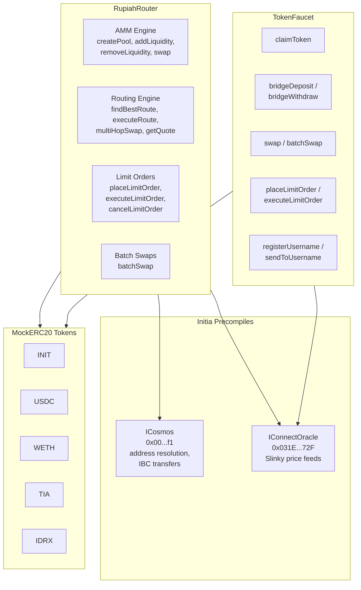
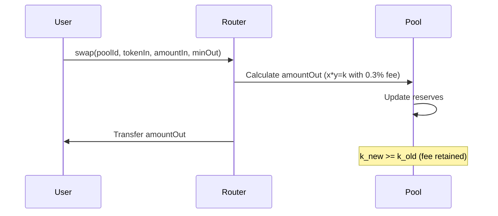
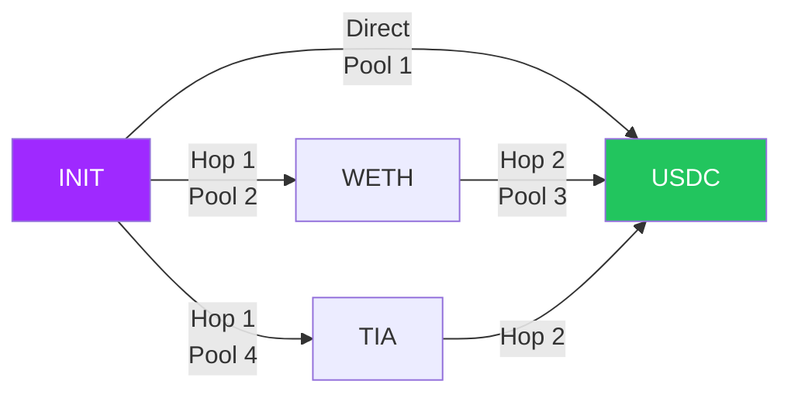
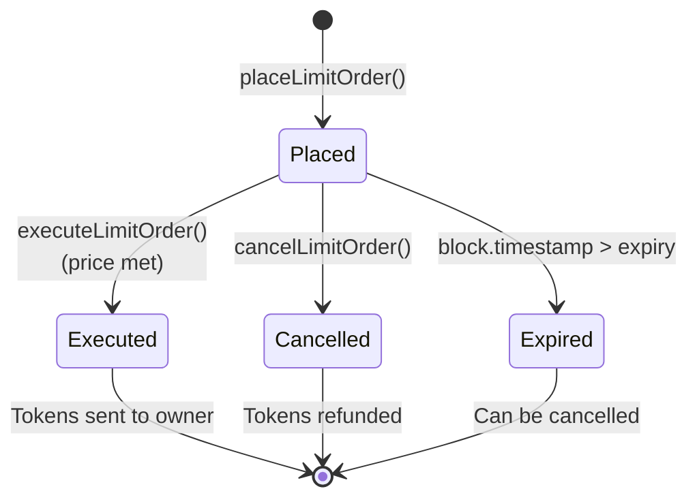

# RupiahRoute Smart Contracts

Solidity smart contracts powering RupiahRoute — a DeFi routing engine on Initia MiniEVM. Implements x\*y=k AMM, multi-hop routing, limit orders, batch swaps, and cross-VM interoperability via Cosmos precompiles.

## Tech Stack

| Tool | Version |
|------|---------|
| Solidity | 0.8.24 |
| Framework | Foundry (Forge) |
| EVM Target | Paris (Initia MiniEVM) |
| Optimizer | 200 runs |

## Contracts

| Contract | Purpose | Address |
|----------|---------|---------|
| **RupiahRouter** | Core AMM + routing engine | `0x3072a5b0...` |
| **TokenFaucet** | Testnet faucet + swap/bridge simulator | `0x114ead71...` |
| **MockERC20** | Test ERC20 tokens | 5 deployed |

### Tokens

| Symbol | Decimals | Address | Faucet Amount |
|--------|----------|---------|---------------|
| INIT | 18 | `0x4e2F9D...` | 10,000 |
| USDC | 6 | `0xE125C4...` | 10,000 |
| WETH | 18 | `0x6cB5dF...` | 5 |
| TIA | 6 | `0xe2B7B1...` | 10,000 |
| IDRX | 2 | `0xF87DA4...` | 100,000,000 |

## Architecture



## Core Mechanics

### AMM (x\*y=k)



- Default swap fee: 0.3% (30 basis points)
- Minimum liquidity: 1000 (locked on first deposit)
- LP tokens proportional to contribution

### Smart Routing

The router finds the optimal path automatically:



- `findBestRoute()` compares direct vs multi-hop (max 3 hops)
- Returns the path with highest output
- `executeRoute()` executes with slippage protection + deadline

### Limit Orders



- Tokens locked in contract on placement
- Anyone can execute (keeper pattern) — 0.1% executor fee
- Expiry enforced on-chain

### TokenFaucet (Testnet)

The faucet serves as an all-in-one testnet utility:

- **Claim**: Mint test tokens (1,000 GAS fee per claim)
- **Swap**: Oracle-priced swaps with 0.3% fee (500 GAS)
- **Batch Swap**: Multi-target swap in one tx (500 GAS)
- **Bridge Sim**: Simulated deposit/withdraw (100 GAS)
- **Limit Orders**: Place/execute/cancel with oracle pricing (500 GAS)
- **Username**: Register .init names, send by username (100 GAS)

Pricing uses internal USD oracle (fixed rates per token).

## Key Parameters

| Parameter | Value |
|-----------|-------|
| Swap Fee | 0.3% (30 bps) |
| Protocol Fee | 500 wei per `executeRoute()` |
| Limit Order Executor Fee | 0.1% (10 bps) |
| Max Routing Hops | 3 |
| Minimum Liquidity | 1000 (locked) |
| Fee Denominator | 10000 (basis points) |

## Security

- Slippage protection via `minOut` parameters
- Deadline validation prevents stale transactions
- `onlyOwner` for admin functions (fee changes, withdrawals)
- Safe ERC20 transfer wrappers
- k-invariant preserved on every swap

## Development

```bash
# Build
forge build

# Test
forge test

# Deploy router
forge script script/RupiahRouter.s.sol \
  --rpc-url $RPC_URL --private-key $DEPLOYER_KEY \
  --broadcast --legacy

# Deploy faucet
forge script script/TokenFaucet.s.sol \
  --rpc-url $RPC_URL --private-key $DEPLOYER_KEY \
  --broadcast --legacy

# Setup pools + tokens
forge script script/SetupPools.s.sol \
  --rpc-url http://localhost:8545 \
  --broadcast --legacy
```

### Environment Variables

```bash
DEPLOYER_KEY=        # Private key for deployment
ROUTER_ADDRESS=      # Deployed RupiahRouter address (for SetupPools)
USER_ADDRESS=        # Test user to receive initial tokens
RPC_URL=             # Initia MiniEVM RPC endpoint
```

## Project Structure

```
sc_RupiahRote/
├── src/
│   ├── RupiahRouter.sol        # Core router (AMM, routing, limits, batch)
│   ├── TokenFaucet.sol         # Testnet faucet + swap/bridge simulator
│   ├── interfaces/
│   │   ├── ICosmos.sol         # Cosmos precompile interface
│   │   └── IConnectOracle.sol  # Slinky oracle interface
│   └── mocks/
│       └── MockERC20.sol       # Test ERC20 with mint/burn
├── script/
│   ├── RupiahRouter.s.sol      # Router deployment
│   ├── TokenFaucet.s.sol       # Faucet deployment
│   └── SetupPools.s.sol        # Token deploy + pool seeding
├── test/
│   └── RupiahRouter.t.sol      # Comprehensive test suite
└── foundry.toml                # Foundry config
```

See the [frontend README](../fe_rupiahrote/README.md) for the web interface.
